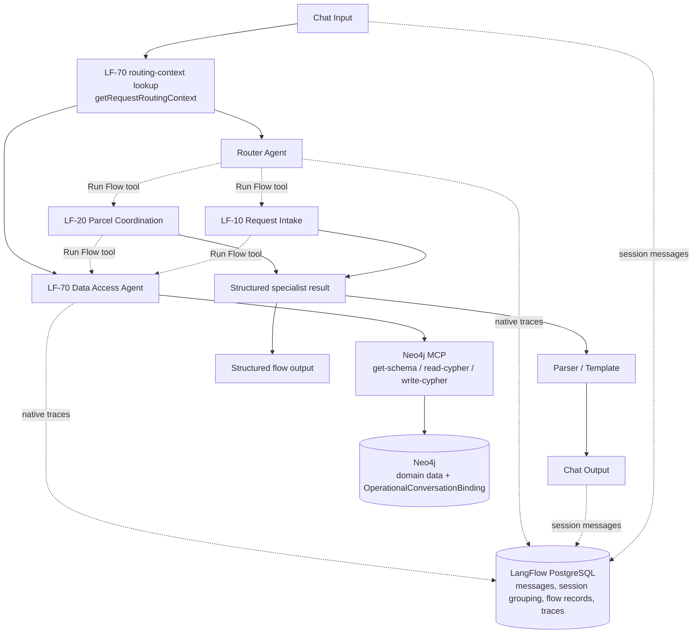
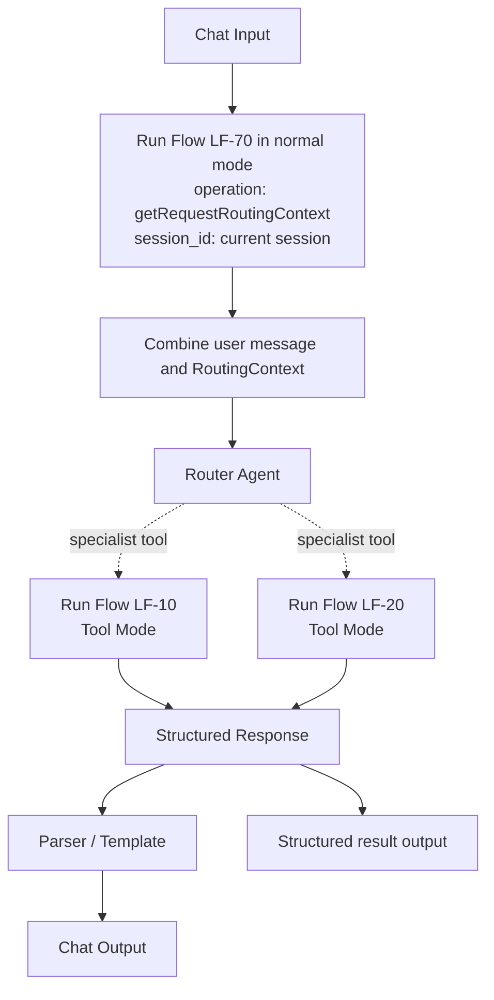
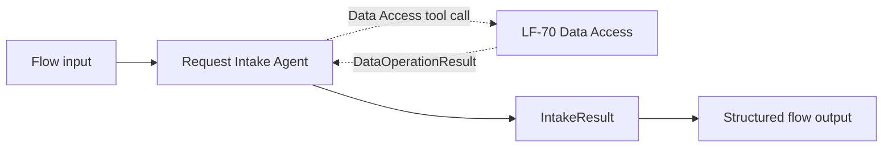
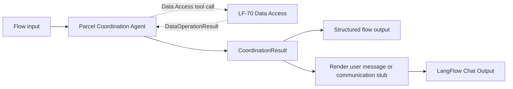
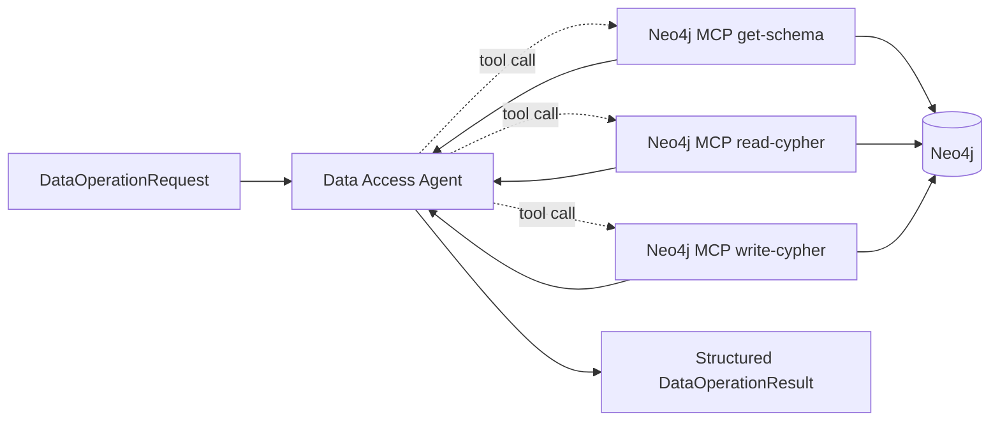
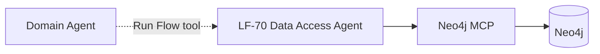
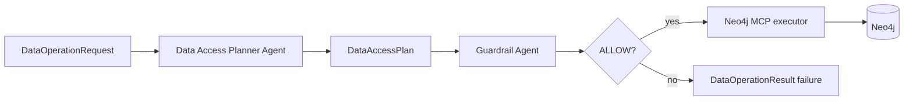
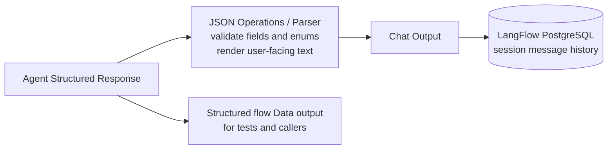

# Hulubul Phase 1 - Walking Skeleton Blueprint

Design intent: preserve a clear path from a minimal end-to-end prototype to the target agentic service without prematurely implementing every production concern.

## 1. Scope and purpose

This blueprint specifies the first implementable Hulubul increment. It intentionally supports a narrow happy path while exercising the critical target architecture: UC-1 intake, agent routing, structured outputs, Data Access Agent delegation, Neo4j MCP, durable request state, LangFlow session memory, and end-to-end lifecycle completion.

### 1.1 Supported use-case slices

| **Use case**                   | **Phase 1 support**                                                                                    |
|--------------------------------|--------------------------------------------------------------------------------------------------------|
| UC-1 Register a parcel request | Skeletal but fundamental: create a draft, capture required data, clarify missing data, reach complete. |
| UC-3 Match and choose          | Simplified: assign one configured seeded transporter; no user choice or ranking.                       |
| UC-4 Forward request           | Simulated: create and display a communication stub; treat it as delivered.                             |
| UC-5 Respond                   | Acceptance only, submitted as a simulated actor message.                                               |
| UC-6 Clarification             | Intake clarification only; transporter-originated clarification deferred.                              |
| UC-7 Pickup                    | Record pickup planning and transporter possession confirmation.                                        |
| UC-8 Delivery                  | Record transporter delivery confirmation.                                                              |
| UC-9 Closure                   | Set DeliveryRequest.closed after delivered; feedback deferred.                                         |

### 1.2 LangFlow flow identifiers

This document uses identifiers such as `LF-00`, `LF-10`, and `LF-70` as concise, document-local names for LangFlow flows:

- `LF` means **LangFlow flow**.
- The number groups flows by responsibility: `00` for the entry/router flow, `10`–`20` for Phase 1 domain flows, and `70` for the shared data-access flow.
- These identifiers are a project naming convention, not a LangFlow platform feature.

The same identifier always refers to the same flow throughout this document.

## 2. Architecture overview

The diagram is read from top to bottom. Solid arrows show mandatory processing steps. Dashed arrows labelled **Run Flow tool** show one LangFlow flow invoking another flow as an agent tool. PostgreSQL stores LangFlow-managed conversation and execution records; Neo4j stores the authoritative Hulubul request state and the Phase 1 operational conversation binding.


### 2.1 Storage responsibilities

| **Store**                   | **Data**                                                                                        | **Reason**                                                                                                 |
|-----------------------------|-------------------------------------------------------------------------------------------------|------------------------------------------------------------------------------------------------------------|
| LangFlow PostgreSQL         | Messages, session_id grouping, flow/application metadata, native traces                         | Use LangFlow built-in support and avoid reimplementing conversation history.                               |
| Neo4j domain graph          | Agent, role participations, DeliveryRequest, Parcel, Place, RequestStatus, assigned transporter | Authoritative business state and relationships.                                                            |
| Neo4j operational extension | `ConversationBinding(sessionId, activeRequestId)`                                              | Loads binding and domain status in one data-access call; avoids a custom PostgreSQL repository in Phase 1. |

ConversationBinding should use an explicitly operational label, for example OperationalConversationBinding, and should not be added to the conceptual JSON Schema. It is a temporary application concern colocated with the domain graph for Phase 1 simplicity.

> **Environment note:** Phase 1 development uses the project's existing Neo4j development instance. Testcontainers creates disposable Neo4j instances only for automated integration and end-to-end tests; it is not the development or production database strategy.

## 3. Phase 1 flow inventory

This section lists the four physical LangFlow flows that make up the Phase 1 implementation and summarizes the responsibility of each one. The LF-xx identifiers are project-local flow names used to make their roles and relationships easier to reference throughout the blueprint.

| **Flow ID** | **Name**            | **Purpose**                                                                                                                     |
|-------------|---------------------|---------------------------------------------------------------------------------------------------------------------------------|
| LF-00       | Main Router         | Accept chat input, prefetch authoritative routing context, invoke the appropriate specialist, and render the structured result. |
| LF-10       | Request Intake      | Create/update the Phase 1 request graph and handle missing intake information.                                                  |
| LF-20       | Parcel Coordination | Assign transporter, simulate forwarding, process acceptance, pickup, delivery, and closure.                                     |
| LF-70       | Data Access         | Translate typed logical operations to Neo4j MCP calls and return typed results.                                                 |

## 4. LF-00 Main Router

### 4.1 Component layout



The routing-context lookup is a mandatory preprocessing step. It runs before the Router Agent rather than being exposed as an optional Router tool, so routing always receives the authoritative Neo4j context.

### 4.2 Routing rules

| **Routing context**                                                                      | **Route**                                                           |
|------------------------------------------------------------------------------------------|---------------------------------------------------------------------|
| No binding / no request                                                                  | Request Intake                                                      |
| new or needsClarification                                                                | Request Intake                                                      |
| complete, optionsProposed, waitingResponse, accepted, pickUpPlanned, pickedUp, delivered | Parcel Coordination                                                 |
| closed timestamp present                                                                 | Return an informational response; reject further Phase 1 mutations. |
| Unknown/inconsistent context                                                             | Return structured failure; do not guess from chat memory.           |

### 4.3 Role of chat memory

LangFlow built-in memory helps interpret the message and preserve conversational continuity. It does not decide the workflow stage. The Router always receives request status and closed state from Neo4j.

## 5. LF-10 Request Intake



### 5.1 Agent responsibility

- Extract the Phase 1 minimum request data from the sender message.

- Create the domain graph immediately when enough identity exists to own a draft.

- Create ConversationBinding for the current session.

- Read the existing request on clarification turns.

- Ask one focused question for missing required data.

- Set status to complete only after all Phase 1 required data exists.

### 5.2 Tools available to the Intake Agent

| **Logical action** | **Agent-facing tool** | **Actual path** |
|---|---|---|
| Create request | `execute_delivery_data_operation` with `operation=createDeliveryRequest` | The tool invokes LF-70. The Data Access Agent uses Neo4j MCP `write-cypher`. |
| Read request | `execute_delivery_data_operation` with `operation=readDeliveryRequest` | The tool invokes LF-70. The Data Access Agent uses Neo4j MCP `read-cypher`. |
| Update request | `execute_delivery_data_operation` with `operation=updateDeliveryRequest` | The tool invokes LF-70. The Data Access Agent uses Neo4j MCP `write-cypher`. |
| Bind session | Included in `createDeliveryRequest` | Create `OperationalConversationBinding` with the request, atomically where practical. |
| Set status | `execute_delivery_data_operation` with `operation=setRequestStatus` | The request includes the expected current status; the Data Access Agent writes the new enum value. |
| Ask clarification | No external tool | Return `IntakeResult.user_message`; the rendering path sends it to Chat Output. |

The label "real data access operation" means the operation has a real Neo4j effect through LF-70. It does not mean that the Intake Agent talks directly to the database.

## 6. LF-20 Parcel Coordination



### 6.1 Agent responsibility

- Assign the configured seeded transporter after the request is complete.

- Produce the simulated transporter request and move the request to waitingResponse.

- Interpret a simulated transporter acceptance.

- Record pickup planning and pickup confirmation.

- Record delivery and set the closed timestamp.

### 6.2 Tools available to the Coordination Agent

| **Logical action**        | **Implementation class** | **Behavior**                                                                                               |
|---------------------------|--------------------------|------------------------------------------------------------------------------------------------------------|
| Read delivery request     | Real                     | Data Access Agent reads the request, status, participants, and assigned transporter.                       |
| Assign seeded transporter | Simplified real          | Data Access Agent resolves the configured transporter identifier and links a Transporter participation.    |
| Set request status        | Real                     | Data Access Agent updates RequestStatus after checking expected_status in the operation request.           |
| Emit communication stub   | Simulated                | Agent returns CommunicationStub; Parser renders it in chat and the same data remains in structured output. |
| Set closed timestamp      | Real                     | Data Access Agent sets DeliveryRequest.closed while status remains delivered.                              |

## 7. LF-70 Data Access

### 7.1 Why a flow-as-tool

LangFlow can expose another flow to an Agent through Run Flow in Tool Mode. LF-10 and LF-20 therefore receive one reusable tool, executeDeliveryDataOperation, whose implementation is LF-70. This preserves a central data-access boundary without requiring a custom component for each operation.

### 7.2 Internal layout



The Data Access Agent chooses among the exposed MCP tools based on the typed logical operation. Domain agents do not see or invoke these MCP tools directly.

### 7.3 Supported operations

| **Operation**            | **Mode** | **Purpose**                                                                                |
|--------------------------|----------|--------------------------------------------------------------------------------------------|
| getRequestRoutingContext | Read     | Resolve session binding and return request status, closed state, and assigned transporter. |
| createDeliveryRequest    | Write    | Create the Phase 1 domain subset and OperationalConversationBinding.                       |
| readDeliveryRequest      | Read     | Read one request and its Phase 1 related objects.                                          |
| updateDeliveryRequest    | Write    | Add clarification or coordination data supported by the Phase 1 subset.                    |
| assignSeededTransporter  | Write    | Resolve configured transporter and attach Transporter participation.                       |
| setRequestStatus         | Write    | Update status using expected_status and target_status.                                     |
| setClosedTimestamp       | Write    | Set DeliveryRequest.closed after delivered.                                                |

### 7.4 MCP exposure

- Expose get-schema, read-cypher, and write-cypher to the Data Access Agent only.

- Do not expose list-gds-procedures.

- Use the configured non-production development Neo4j instance and restricted database credentials where practical. Disposable Neo4j instances are reserved for automated tests.

- Keep all domain-agent tools at the logical operation level.

- Use a stable tool name and a precise description because the Agent chooses tools from their metadata.

## 8. Guardrail evolution

### 8.1 Phase 1



No Guardrail Agent is present because the current phase explicitly prioritizes the first working loop. The development-only risk is bounded by schemas, a fixed operation enum, the Data Access boundary, a seeded database, and independent tests.

### 8.2 Phase 2 insertion



The Guardrail Agent must be a mandatory sequential stage. The planner must not retain direct access to write-cypher, otherwise the guardrail could be bypassed. The caller-facing DataOperationRequest/DataOperationResult contract stays unchanged.

## 9. Domain-model subset

| **Type**                        | **Phase 1 use**                                                                                             |
|---------------------------------|-------------------------------------------------------------------------------------------------------------|
| Agent                           | Create/reuse sender and receiver identities; use a seeded transporter Agent.                                |
| Sender / Receiver / Transporter | Create request-specific role participations linked through playedBy.                                        |
| DeliveryRequest                 | Authoritative request aggregate, status, participants, parcel, locations, timestamps, assigned transporter. |
| Parcel                          | At least id and declaredContent.                                                                            |
| Place                           | Simplified pickup and drop-off location; exact Address is deferred.                                         |
| RequestStatus                   | Use only values present in the supplied enum.                                                               |
| OperationalConversationBinding  | Operational extension: sessionId and link/reference to the active request.                                  |

### 9.1 Phase 1 required intake data

- Sender name or stable test identifier.

- Receiver name or stable test identifier.

- Pickup location text represented as Place.

- Drop-off location text represented as Place.

- Parcel declared-content description.

- preferredPeriod is optional.

## 10. Phase 1 transition profile

| **Current state**  | **Trigger/operation**           | **Next state/effect**                           |
|--------------------|---------------------------------|-------------------------------------------------|
| none               | createDeliveryRequest           | new                                             |
| new                | required data missing           | needsClarification                              |
| new                | required data complete          | complete                                        |
| needsClarification | missing data supplied           | complete                                        |
| complete           | assignSeededTransporter         | optionsProposed                                 |
| optionsProposed    | emit simulated request          | waitingResponse                                 |
| waitingResponse    | simulated transporter accepts   | accepted                                        |
| accepted           | pickup plan supplied            | pickUpPlanned                                   |
| pickUpPlanned      | transporter confirms possession | pickedUp                                        |
| pickedUp           | transporter confirms delivery   | delivered                                       |
| delivered          | setClosedTimestamp              | status stays delivered; closed becomes non-null |

The values matching, sentToTransporter, noMatch, transporterClarification, and closed are not added because they are absent from the supplied RequestStatus enum. Operational action names can still express these concepts without changing the domain enum.

## 11. Operational schemas

The following blocks describe the intended Phase 1 exchange shapes. They are conceptual schema summaries, not the final source-controlled JSON Schema files. Values such as `"string | empty"` describe the permitted shape.

### 11.1 RoutingContext

```json
{
  "session_id": "string",
  "binding_found": "boolean",
  "request_id": "string | empty",
  "request_status": "new | needsClarification | complete | optionsProposed | waitingResponse | accepted | rejected | pickUpPlanned | pickedUp | delivered | cancelled | none",
  "closed": "boolean",
  "assigned_transporter_id": "string | empty",
  "routing_stage": "intake | coordination | closed | none",
  "error_code": "string | empty"
}
```

### 11.2 RouterResult

```json
{
  "target_agent": "requestIntake | parcelCoordination | none",
  "request_id": "string | empty",
  "routing_reason": "string",
  "user_message": "string",
  "error_code": "string | empty"
}
```

### 11.3 IntakeResult

```json
{
  "result_type": "clarificationRequired | requestComplete | failure",
  "request_id": "string",
  "current_status": "new | needsClarification | complete",
  "missing_fields": ["string"],
  "user_message": "string",
  "next_expected_action": "provideMissingData | none",
  "error_code": "string | empty",
  "error_message": "string | empty"
}
```

### 11.4 CoordinationResult

```json
{
  "result_type": "actionCompleted | waitingForInput | failure",
  "operation": "assignTransporter | simulateForwarding | acceptRequest | planPickup | confirmPickup | confirmDelivery | closeRequest | none",
  "request_id": "string",
  "previous_status": "string",
  "current_status": "string",
  "user_message": "string",
  "next_expected_actor": "sender | transporter | system | none",
  "next_expected_action": "string",
  "communication": "CommunicationStub | null",
  "error_code": "string | empty",
  "error_message": "string | empty"
}
```

### 11.5 DataOperationRequest

```json
{
  "operation": "getRequestRoutingContext | createDeliveryRequest | readDeliveryRequest | updateDeliveryRequest | assignSeededTransporter | setRequestStatus | setClosedTimestamp",
  "session_id": "string | empty",
  "request_id": "string | empty",
  "expected_status": "string | empty",
  "target_status": "string | empty",
  "payload_json": "JSON-encoded string",
  "correlation_id": "string"
}
```

### 11.6 DataOperationResult

```json
{
  "success": "boolean",
  "operation": "string",
  "request_id": "string | empty",
  "current_status": "string | empty",
  "affected_records": "integer",
  "result_json": "JSON-encoded string",
  "error_code": "string | empty",
  "error_message": "string | empty"
}
```

### 11.7 CommunicationStub

```json
{
  "request_id": "string",
  "message_type": "transportRequest | statusNotification",
  "from_role": "system",
  "to_role": "transporter | sender",
  "to_actor_id": "string",
  "message_text": "string",
  "delivery_mode": "simulated",
  "simulated_delivery_status": "delivered"
}
```

Keep the Agent output schemas flat where possible because the LangFlow Agent output-schema editor is table-oriented. Validate the corresponding full JSON Schema or Pydantic model in the automated test harness.

## 12. Structured output and chat rendering



The rendering step selects `user_message` or `CommunicationStub.message_text` and converts it into the Chat Output message. Use the Structured Response output only. Connecting both Agent response outputs would generate separate model calls. Structured Response alone is not written to chat history, so the explicit rendering-to-Chat-Output path is required and must be tested.

## 13. Phase 1 sequence

1. Sender starts a session and states the parcel intention.

2. Routing prefetch finds no binding; Router invokes Intake.

3. Intake creates the draft domain graph and ConversationBinding.

4. If data is missing, status becomes needsClarification and Chat Output asks one question.

5. The next message resolves the same request through the binding; status becomes complete.

6. Router invokes Coordination; seeded transporter is attached and status becomes optionsProposed.

7. Coordination emits a simulated transporter message in chat and structured output; status becomes waitingResponse.

8. A simulated transporter acceptance advances to accepted.

9. Pickup plan and possession messages advance to pickUpPlanned and pickedUp.

10. Delivery advances to delivered and the next operation sets the closed timestamp.

## 14. Testability hooks

- Every flow has typed inputs and structured outputs that can be invoked through the LangFlow API.

- Every data operation has a correlation_id and returns affected_records.

- All tests use unique session and request identifiers.

- Neo4j writes are verified independently through the Neo4j driver, not by asking the Data Access Agent to re-read its own result.

- Expected-status negative tests ensure invalid transitions do not modify the graph.

- LangFlow traces are inspected to verify the MCP boundary and tool-call path.

## 15. Phase 1 acceptance criteria

1. UC-1 skeletal intake works in one message and with one clarification turn.

2. ConversationBinding and the required domain subset are stored in Neo4j.

3. Routing always uses Neo4j context rather than relying solely on chat history.

4. The Data Access Agent is invoked through a LangFlow Run Flow tool and is the only agent with MCP tools.

5. A seeded transporter is assigned and the simulated message appears in chat and structured output.

6. Acceptance, pickup, delivery, and closure are persisted across separate interactions.

7. Restart/resume works with retained PostgreSQL and Neo4j.

8. All operational-schema and automated test gates in the verification strategy pass.

## 16. Inputs still needed before implementation

- The configured seeded transporter identifier.

- The exact graph mapping/relationship names if they are not derivable from the generated Neo4j schema.

- The model/provider used for each Phase 1 agent and the LLM-as-judge.

- Whether the first automated test environment launches LangFlow as part of Docker Compose or tests an already-running development instance.

## 17. Source inputs

- Hulubul V1 - Use Cases (DRAFT).

- hulubul.schema.json.

## References

- [LangFlow agents and Structured Response](https://docs.langflow.org/agents)

- [LangFlow tools and flows as tools](https://docs.langflow.org/agents-tools)

- [LangFlow Run Flow](https://docs.langflow.org/run-flow)

- [LangFlow MCP Tools](https://docs.langflow.org/mcp-tools)

- [LangFlow session IDs](https://docs.langflow.org/session-id)

- [LangFlow custom PostgreSQL database](https://docs.langflow.org/configuration-custom-database)

- [Neo4j MCP tools and read-only mode](https://neo4j.com/docs/mcp/current/tools/)
