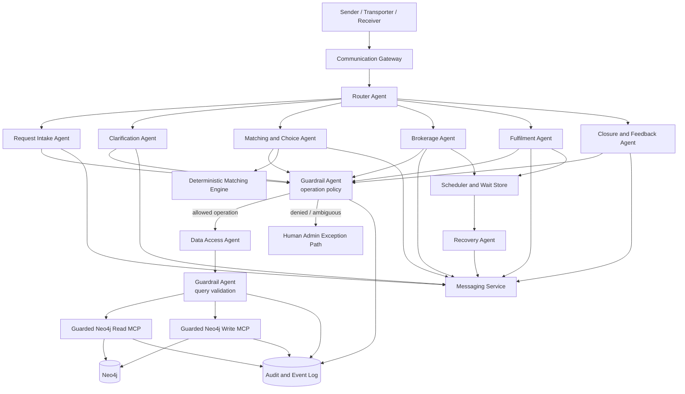
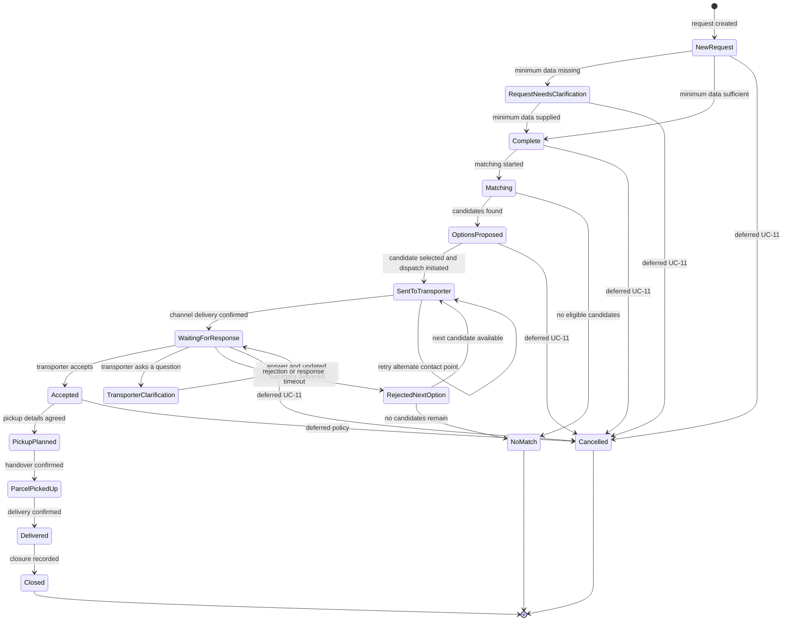

# Hulubul Agentic System Blueprint v0.2

## 1. Scope interpretation

### Included user-goal use cases

* **UC-1:** Register a parcel request
* **UC-3:** Match and choose a transporter
* **UC-4:** Forward request to a transporter
* **UC-5:** Respond to a transport request
* **UC-6:** Provide clarification or missing information
* **UC-7:** Plan pick-up and hand over the parcel
* **UC-8:** Coordinate and confirm delivery
* **UC-9:** Close request and collect feedback

The use cases describe a manually assisted V1, but also state that the Admin role can be replaced by the System or agents in the autonomous direction. The blueprint therefore treats human Admin involvement as an execution mode and exception path, rather than making successful parcel intermediation depend on a human operator.

### Necessary dependencies from excluded use cases

Some behaviour from excluded use cases is still required internally:

| Deferred use case             | Required dependency                                                                                                                                                           |
| ----------------------------- | ----------------------------------------------------------------------------------------------------------------------------------------------------------------------------- |
| UC-2 — Transporter preference | UC-3 may read an already-recorded preference, but this iteration does not create, validate, or anonymously notify preferred Transporters.                                     |
| UC-10 — Cascade               | Rejection and timeout in UC-5 require automatic selection of the next candidate. Implement this as an internal Brokerage Agent subflow, not as a separately exposed use case. |
| UC-11 — Cancellation          | Keep the `Cancelled` state in the model, but defer conversational cancellation handling unless it is needed for testing.                                                      |
| UC-13 — Party profile         | UC-1 requires an identifiable Sender. Implement minimal Sender bootstrap, but defer full profile registration and maintenance.                                                |
| UC-12 — Transporter profile   | Matching assumes Transporter profiles, routes, and contact points already exist as fixtures or seeded data.                                                                   |

---

# 2. Main conclusions from the use cases

## 2.1 Clarification is a shared capability with two distinct contexts

UC-6 covers two fundamentally different situations:

1. The System detects missing data while registering the request.
2. A Transporter asks for additional information after receiving the request.

These situations must not share the same state transition.

```text
Intake clarification:
NewRequest → RequestNeedsClarification → Complete

Transporter clarification:
WaitingForResponse → TransporterClarification → WaitingForResponse
```

Returning a Transporter clarification to `Complete` would incorrectly restart matching.

## 2.2 UC-4 and UC-5 form a brokerage process

Forwarding a request, waiting, processing acceptance or rejection, asking for clarification, sending reminders, and moving to the next option belong to one cohesive area of expertise.

They should therefore be owned by one **Brokerage Agent**, not split between unrelated agents.

## 2.3 UC-7 and UC-8 form a fulfilment process

Pickup planning, parcel handover, delivery coordination, and delivery confirmation are contiguous phases of the same accepted transport.

They should initially be owned by one **Fulfilment Agent**.

## 2.4 UC-9 deserves a separate ownership boundary

Closing a request and collecting feedback are not transport coordination. Closure requires:

* verification that delivery is confirmed;
* historical retention;
* closure audit;
* optional feedback handling.

A small **Closure and Feedback Agent** provides a cleaner boundary. It can later be merged into Fulfilment if the separate flow proves unnecessarily small.

## 2.5 Matching must produce a reusable candidate queue

UC-3 allows the Sender to select or rank options, while UC-5 may later require moving to another option.

The matching result therefore needs a persistent ordered candidate queue:

```text
candidate_order =
    sender-defined ranking, when supplied
    otherwise:
    selected candidate first + original system ranking for the remainder
```

The Brokerage Agent consumes this queue without rerunning matching after each rejection.

---

# 3. Revised agent inventory

## Primary agents

1. **Router Agent**
2. **Request Intake Agent**
3. **Clarification Agent**
4. **Matching and Choice Agent**
5. **Brokerage Agent**
6. **Fulfilment Agent**
7. **Closure and Feedback Agent**
8. **Recovery Agent**
9. **Data Access Agent**
10. **Guardrail Agent**

This does not mean that every component must use a separate model invocation. The Clarification and Closure agents can initially be LangFlow subflows with narrow prompts and can later be merged if operational experience shows that the separation adds no value.

---

# 4. Revised logical architecture



## Important architectural boundary

The Data Access Agent must not receive an unguarded Neo4j MCP connection.

It should receive only tools such as:

```text
guarded_neo4j_read
guarded_neo4j_write
```

Each tool is itself a flow containing policy checks and the raw Neo4j MCP component.

---

# 5. Use-case ownership matrix

| Use case                             | Primary conversational actor    | Owning agent               | Supporting agents/components                        |
| ------------------------------------ | ------------------------------- | -------------------------- | --------------------------------------------------- |
| UC-1 Register request                | Sender                          | Request Intake Agent       | Clarification Agent, Data Access Agent              |
| UC-3 Match and choose                | Sender                          | Matching and Choice Agent  | Matching Engine, Data Access Agent                  |
| UC-4 Forward request                 | System/Admin                    | Brokerage Agent            | Messaging Service, Data Access Agent                |
| UC-5 Respond to request              | Transporter                     | Brokerage Agent            | Clarification Agent, Recovery Agent                 |
| UC-6 Provide clarification           | Sender or Receiver              | Clarification Agent        | Intake Agent or Brokerage Agent as resumption owner |
| UC-7 Plan pickup and handover        | Sender and Transporter          | Fulfilment Agent           | Messaging Service                                   |
| UC-8 Coordinate and confirm delivery | Transporter, Receiver or Sender | Fulfilment Agent           | Recovery Agent                                      |
| UC-9 Close and collect feedback      | System/Admin                    | Closure and Feedback Agent | Data Access Agent, Messaging Service                |

---

# 6. Revised state machine



## State semantics

### `SentToTransporter`

This state now has a precise meaning:

> A dispatch operation has started, but successful channel delivery has not yet been confirmed.

This supports UC-4 extension 2a:

* retry the same Contact Point;
* try another Contact Point belonging to the same Transporter;
* escalate to Admin;
* only then decide whether to skip the candidate.

### `WaitingForResponse`

This means:

> The request summary was successfully delivered to the selected Transporter and a response deadline is active.

### `TransporterClarification`

This means:

> The selected Transporter has asked a question and the current offer remains active, but its response timer has been suspended or replaced by a clarification timer.

### `Delivered`

This means:

> Delivery was confirmed by an authorized participant, but closure has not yet been recorded.

### `Closed`

This means:

> The operational request is complete. Feedback may still be collected without reopening the request.

---

# 7. Domain event catalogue

The agents should request domain events. They must not assign statuses directly.

| Event                                 | Source state                              | Target state                | Authorized origin                                   |
| ------------------------------------- | ----------------------------------------- | --------------------------- | --------------------------------------------------- |
| `REQUEST_CREATED`                     | None                                      | `NewRequest`                | Request Intake Agent                                |
| `REQUEST_DATA_INCOMPLETE`             | `NewRequest`                              | `RequestNeedsClarification` | Intake Agent                                        |
| `REQUEST_COMPLETED`                   | `NewRequest`, `RequestNeedsClarification` | `Complete`                  | Intake Agent after deterministic completeness check |
| `MATCHING_STARTED`                    | `Complete`                                | `Matching`                  | Matching Agent                                      |
| `MATCHES_FOUND`                       | `Matching`                                | `OptionsProposed`           | Matching Agent                                      |
| `NO_MATCHES_FOUND`                    | `Matching`                                | `NoMatch`                   | Matching Agent                                      |
| `CANDIDATE_DISPATCH_STARTED`          | `OptionsProposed`, `RejectedNextOption`   | `SentToTransporter`         | Brokerage Agent                                     |
| `TRANSPORTER_MESSAGE_DELIVERED`       | `SentToTransporter`                       | `WaitingForResponse`        | Messaging delivery callback                         |
| `TRANSPORTER_ACCEPTED`                | `WaitingForResponse`                      | `Accepted`                  | Selected Transporter                                |
| `TRANSPORTER_REJECTED`                | `WaitingForResponse`                      | `RejectedNextOption`        | Selected Transporter                                |
| `TRANSPORTER_RESPONSE_TIMED_OUT`      | `WaitingForResponse`                      | `RejectedNextOption`        | Recovery policy                                     |
| `TRANSPORTER_REQUESTED_CLARIFICATION` | `WaitingForResponse`                      | `TransporterClarification`  | Selected Transporter                                |
| `TRANSPORTER_CLARIFICATION_DELIVERED` | `TransporterClarification`                | `WaitingForResponse`        | Clarification Agent after updated summary delivery  |
| `NEXT_CANDIDATE_SELECTED`             | `RejectedNextOption`                      | `SentToTransporter`         | Brokerage Agent                                     |
| `CANDIDATES_EXHAUSTED`                | `RejectedNextOption`                      | `NoMatch`                   | Brokerage Agent                                     |
| `PICKUP_DETAILS_AGREED`               | `Accepted`                                | `PickupPlanned`             | Sender or selected Transporter                      |
| `PARCEL_HANDOVER_CONFIRMED`           | `PickupPlanned`                           | `ParcelPickedUp`            | Selected Transporter, optionally Sender             |
| `DELIVERY_CONFIRMED`                  | `ParcelPickedUp`                          | `Delivered`                 | Transporter, Receiver or Sender according to policy |
| `REQUEST_CLOSED`                      | `Delivered`                               | `Closed`                    | Closure Agent or Admin                              |
| `REQUEST_CANCELLED`                   | Permitted active states                   | `Cancelled`                 | Sender; deferred in current scope                   |

---

# 8. Agent specifications and tools

## 8.1 Router Agent

### Responsibility

The Router Agent determines:

* which parcel request the message concerns;
* which pending interaction it answers;
* which specialist agent should process it;
* whether disambiguation is necessary.

It must use:

* authenticated actor;
* actor role;
* channel identity;
* reply-to message;
* active requests;
* current request states;
* pending clarification, selection, response, pickup, or delivery actions.

It must not infer the target request solely from message text.

### Tools

| Tool                         | Purpose                                                                  |
| ---------------------------- | ------------------------------------------------------------------------ |
| `resolve_channel_actor`      | Map channel identity to Sender, Transporter, Receiver, or Admin context. |
| `get_actor_open_requests`    | Retrieve requests in which the actor currently participates.             |
| `get_pending_interactions`   | Retrieve unanswered questions, offers, selections, and confirmations.    |
| `resolve_reply_reference`    | Correlate a reply with the outbound message that prompted it.            |
| `start_request_goal`         | Create a goal/session for a new parcel request.                          |
| `route_to_intake`            | Invoke the Request Intake Agent flow.                                    |
| `route_to_clarification`     | Invoke the Clarification Agent flow.                                     |
| `route_to_matching`          | Invoke the Matching and Choice Agent flow.                               |
| `route_to_brokerage`         | Invoke the Brokerage Agent flow.                                         |
| `route_to_fulfilment`        | Invoke the Fulfilment Agent flow.                                        |
| `route_to_closure`           | Invoke the Closure and Feedback Agent flow.                              |
| `ask_request_disambiguation` | Ask the user which request they mean.                                    |

### Restrictions

The Router receives no raw Neo4j MCP tools and no state-changing tools.

---

## 8.2 Request Intake Agent

### Use-case ownership

* UC-1
* System-detected branch of UC-6

### Responsibility

* understand the parcel-sending intention;
* resolve or minimally bootstrap the Sender;
* create a draft request immediately;
* extract request information;
* check completeness;
* request missing information;
* complete the request when deterministic rules pass.

### Tools

| Tool                            | Purpose                                                                 |
| ------------------------------- | ----------------------------------------------------------------------- |
| `resolve_sender_profile`        | Find the Sender associated with the channel identity.                   |
| `create_minimal_sender_profile` | Create only the minimum Sender identity required for UC-1.              |
| `create_request_draft`          | Create the request and Request ID in `NewRequest`.                      |
| `get_request_snapshot`          | Retrieve the current request and version.                               |
| `extract_request_fields`        | Produce a typed partial request from the Sender message.                |
| `update_request_fields`         | Submit changed request information through guarded data access.         |
| `store_attachment_reference`    | Associate a photo or file reference with the request.                   |
| `evaluate_minimum_data`         | Deterministically determine whether the minimum-data rule is satisfied. |
| `open_clarification_case`       | Create an intake clarification with requested items.                    |
| `propose_domain_event`          | Request `REQUEST_DATA_INCOMPLETE` or `REQUEST_COMPLETED`.               |
| `send_message`                  | Ask for missing data or confirm completion.                             |

### Minimal Sender bootstrap

Because UC-13 is out of scope, this iteration should not implement full profile maintenance.

Recommended rule:

```text
No Sender profile:
  create minimal Sender profile sufficient to own the request

Incomplete Sender profile:
  collect only information needed for UC-1

Full profile editing:
  deferred to UC-13
```

---

## 8.3 Clarification Agent

### Use-case ownership

* UC-6
* Shared by UC-1 and UC-5

### Responsibility

The Clarification Agent manages a typed clarification case.

```json
{
  "clarification_id": "clarification-id",
  "request_id": "request-id",
  "type": "INTAKE_MISSING_DATA | TRANSPORTER_QUESTION",
  "requested_by": "system-or-transporter-id",
  "requested_items": [],
  "resume_owner": "intake_agent | brokerage_agent",
  "resume_state": "Complete | WaitingForResponse",
  "target_transporter_id": "optional",
  "deadline": "optional"
}
```

### Tools

| Tool                                | Purpose                                                               |
| ----------------------------------- | --------------------------------------------------------------------- |
| `get_clarification_case`            | Retrieve the outstanding questions and origin.                        |
| `extract_clarification_answers`     | Map the response to requested items.                                  |
| `update_request_fields`             | Add answers to the same Request ID.                                   |
| `store_attachment_reference`        | Store references to supplied photos or documents.                     |
| `evaluate_minimum_data`             | Recheck completeness for intake clarification.                        |
| `build_updated_transporter_summary` | Rebuild the summary for a Transporter question.                       |
| `send_updated_summary`              | Send the answer to the selected Transporter.                          |
| `close_clarification_case`          | Mark the clarification as resolved.                                   |
| `propose_domain_event`              | Request `REQUEST_COMPLETED` or `TRANSPORTER_CLARIFICATION_DELIVERED`. |
| `send_message`                      | Ask follow-up questions or acknowledge completion.                    |

### Important routing rule

The same user message can produce different outcomes:

```text
INTAKE_MISSING_DATA:
  answer → completeness check → Complete

TRANSPORTER_QUESTION:
  answer → resend updated summary → WaitingForResponse
```

---

## 8.4 Matching and Choice Agent

### Use-case ownership

* UC-3

### Responsibility

* initiate matching;
* request eligible Transporters from the matching engine;
* present up to three options;
* explain the recommendations;
* capture Sender selection or ranking;
* persist the candidate queue;
* hand control to the Brokerage Agent.

### Tools

| Tool                                | Purpose                                                                            |
| ----------------------------------- | ---------------------------------------------------------------------------------- |
| `get_matching_context`              | Retrieve route, parcel, date, urgency, preference, and usable profile information. |
| `run_transporter_matching`          | Execute deterministic eligibility and ranking logic.                               |
| `save_match_result`                 | Persist candidate IDs, ordering, scores, and reason codes.                         |
| `get_presentable_candidate_details` | Return only information the Sender is allowed to see.                              |
| `record_sender_candidate_order`     | Store the Sender’s selection or ranking.                                           |
| `build_candidate_queue`             | Produce the order the Brokerage Agent should consume.                              |
| `propose_domain_event`              | Request `MATCHING_STARTED`, `MATCHES_FOUND`, or `NO_MATCHES_FOUND`.                |
| `start_brokerage`                   | Invoke Brokerage after selection.                                                  |
| `send_message`                      | Present options and request selection or ranking.                                  |

### Matching tool output

```json
{
  "request_id": "request-id",
  "options": [
    {
      "candidate_id": "candidate-id",
      "transporter_id": "transporter-id",
      "contact_point_ids": ["contact-1"],
      "system_rank": 1,
      "eligibility": "ELIGIBLE",
      "reason_codes": [
        "EXPRESSED_PREFERENCE",
        "RELEVANT_ROUTE",
        "PAST_EXPERIENCE",
        "DATE_COMPATIBLE"
      ],
      "score": 0.91
    }
  ]
}
```

The final scoring formula can remain undecided, but eligibility and ranking must remain outside the agent prompt.

---

## 8.5 Brokerage Agent

### Use-case ownership

* UC-4
* UC-5
* Transporter-originated branch of UC-6
* Minimum cascade behaviour required by UC-5

### Responsibility

* consume the candidate queue;
* build the request summary;
* select a valid Contact Point;
* forward the request;
* monitor delivery;
* process acceptance, rejection, or questions;
* schedule reminders and deadlines;
* move to the next candidate after rejection or timeout;
* notify the Sender.

### Tools

| Tool                                | Purpose                                                                 |
| ----------------------------------- | ----------------------------------------------------------------------- |
| `get_candidate_queue`               | Retrieve ordered candidates and prior attempt results.                  |
| `select_current_candidate`          | Select the next unused candidate.                                       |
| `get_usable_contact_points`         | Retrieve validated Contact Points for the candidate.                    |
| `build_transporter_request_summary` | Produce the scoped summary using the same Request ID.                   |
| `forward_request_to_transporter`    | Send automatically or create an Admin forwarding task.                  |
| `record_dispatch_attempt`           | Record channel, Contact Point, summary version, and timestamp.          |
| `schedule_response_deadline`        | Create a reminder and final response deadline.                          |
| `cancel_response_deadline`          | Cancel the wait after acceptance, rejection, or question.               |
| `record_transporter_response`       | Record accept, reject, or clarification request.                        |
| `open_clarification_case`           | Create a `TRANSPORTER_QUESTION` clarification.                          |
| `select_next_candidate`             | Advance through the existing queue.                                     |
| `propose_domain_event`              | Request dispatch, acceptance, rejection, timeout, or exhaustion events. |
| `notify_sender`                     | Inform the Sender about acceptance, rejection, delay, or No Match.      |
| `create_admin_exception_task`       | Escalate channel failure or inconsistent response.                      |

### Automated versus assisted forwarding

The forwarding tool should support:

```text
AUTOMATED:
  System sends directly through the gateway.

ADMIN_ASSISTED:
  System prepares the summary and creates an Admin task.
  Admin confirms the actual send.
```

The rest of the state machine remains unchanged.

### Channel delivery rule

`SentToTransporter → WaitingForResponse` should occur only after:

* a successful channel delivery callback; or
* explicit Admin confirmation in assisted mode.

---

## 8.6 Fulfilment Agent

### Use-case ownership

* UC-7
* UC-8

### Responsibility

* record pickup coordination;
* record pickup plan;
* record handover confirmation;
* record delivery notes;
* accept delivery confirmation from authorized participants;
* notify relevant parties;
* follow up when confirmation is missing.

Detailed coordination may happen directly between Sender and Transporter. The system therefore records only the minimum operational information required by the use cases.

### Tools

| Tool                           | Purpose                                                     |
| ------------------------------ | ----------------------------------------------------------- |
| `get_fulfilment_context`       | Retrieve accepted request, participants, and current state. |
| `record_pickup_plan`           | Store place, time, and contact person.                      |
| `record_pickup_note`           | Store coordination notes communicated through Hulubul.      |
| `record_handover_confirmation` | Record Transporter or Sender confirmation of receipt.       |
| `record_delivery_note`         | Record delivery-related information.                        |
| `record_delivery_confirmation` | Record confirmation and confirming actor.                   |
| `get_visible_party_contact`    | Retrieve contact information allowed at the current stage.  |
| `schedule_pickup_followup`     | Schedule follow-up if handover is not confirmed.            |
| `schedule_delivery_followup`   | Schedule follow-up if delivery is not confirmed.            |
| `propose_domain_event`         | Request pickup, handover, or delivery transitions.          |
| `notify_participants`          | Notify Sender and optionally Receiver or Transporter.       |
| `create_admin_exception_task`  | Escalate disputed or indefinitely unconfirmed delivery.     |

### Delivery confirmation policy

UC-8 allows confirmation from:

* Transporter;
* Receiver;
* Sender.

The event must record:

```json
{
  "confirmed_by_actor_id": "actor-id",
  "confirmed_by_role": "transporter | receiver | sender",
  "confirmation_channel": "channel",
  "confirmed_at": "timestamp"
}
```

Whether every role can independently close delivery or whether some confirmations require corroboration remains a policy decision.

---

## 8.7 Closure and Feedback Agent

### Use-case ownership

* UC-9

### Responsibility

* verify that delivery has been validly confirmed;
* close the request;
* retain history;
* optionally request feedback;
* record feedback without reopening the operational process.

### Tools

| Tool                             | Purpose                                                   |
| -------------------------------- | --------------------------------------------------------- |
| `get_closure_context`            | Retrieve delivery confirmation and unresolved exceptions. |
| `validate_closure_preconditions` | Deterministically check whether closure is allowed.       |
| `propose_domain_event`           | Request `REQUEST_CLOSED`.                                 |
| `send_feedback_request`          | Ask the Sender for optional feedback.                     |
| `record_feedback`                | Store feedback or an internal note.                       |
| `record_closure_summary`         | Persist the final outcome and relevant timestamps.        |
| `create_admin_exception_task`    | Escalate incomplete or contradictory delivery evidence.   |

### Recommended sequence

```text
Delivery confirmed
  → persist Delivered
  → notify Sender
  → validate closure
  → persist Closed
  → optionally request feedback
```

Feedback is a post-closure interaction and must not keep the parcel request operationally open.

---

## 8.8 Recovery Agent

### Responsibility

The Recovery Agent handles scheduled work rather than ordinary inbound messages.

It supports:

* unanswered intake clarification;
* unanswered Transporter clarification;
* Transporter response reminder;
* Transporter response timeout;
* automatic candidate cascade;
* pickup follow-up;
* delivery confirmation follow-up.

### Tools

| Tool                          | Purpose                                             |
| ----------------------------- | --------------------------------------------------- |
| `get_due_wait_conditions`     | Retrieve processes with due reminders or deadlines. |
| `get_recovery_policy`         | Load timeout and reminder configuration.            |
| `record_recovery_attempt`     | Atomically increment the recovery count.            |
| `send_reminder`               | Send a context-specific reminder.                   |
| `expire_wait_condition`       | Mark a waiting period as expired.                   |
| `propose_domain_event`        | Request a timeout or cascade event.                 |
| `invoke_owning_agent`         | Resume Brokerage, Clarification, or Fulfilment.     |
| `create_admin_exception_task` | Escalate after the configured limit.                |

### Restriction

The Recovery Agent should not decide arbitrary business policy.

For example:

```text
Response deadline passed:
  deterministic policy says whether to remind or cascade

Recovery Agent:
  formulates the message and invokes the prescribed action
```

---

## 8.9 Data Access Agent

### Responsibility

The Data Access Agent:

* understands the Neo4j schema;
* translates approved logical operations into parameterized Cypher;
* requests guarded reads and writes;
* translates Neo4j results into typed domain results.

It never communicates directly with users.

### Tools available to the Data Access Agent

| Tool                       | Purpose                                                           |
| -------------------------- | ----------------------------------------------------------------- |
| `get_schema_snapshot`      | Retrieve the approved schema description.                         |
| `guarded_neo4j_read`       | Submit a scoped, parameterized read through the read guardrail.   |
| `guarded_neo4j_write`      | Submit a scoped, parameterized write through the write guardrail. |
| `validate_result_shape`    | Validate Neo4j results against the expected operation schema.     |
| `record_data_access_audit` | Record purpose, query hash, actor scope, and result metadata.     |

### Tools not available

* raw Neo4j MCP;
* unrestricted `read-cypher`;
* unrestricted `write-cypher`;
* database administration;
* hard deletion;
* index or constraint creation;
* arbitrary schema mutation.

### Data operation contract

```json
{
  "operation_id": "RECORD_TRANSPORTER_RESPONSE",
  "mode": "WRITE",
  "requested_by_agent": "brokerage_agent",
  "actor": {
    "id": "actor-id",
    "role": "transporter"
  },
  "resource": {
    "type": "ParcelRequest",
    "id": "request-id",
    "expected_state": "WaitingForResponse",
    "expected_version": 8
  },
  "business_event": "TRANSPORTER_ACCEPTED",
  "payload": {},
  "idempotency_key": "inbound-message-id"
}
```

---

## 8.10 Guardrail Agent

### Responsibility

The initial Guardrail Agent evaluates:

* whether the calling agent may request the operation;
* whether the actor may perform it;
* whether the actor is related to the request;
* whether the current state permits the event;
* whether the requested fields are in scope;
* whether the generated Cypher matches the approved operation;
* whether the read would disclose unrelated data;
* whether idempotency and version requirements are present.

### Two-stage use

#### Stage 1: operation policy

```text
Specialist agent
  → logical operation request
  → Guardrail Agent
  → allow or deny operation intent
```

#### Stage 2: query policy

```text
Allowed operation
  → Data Access Agent creates Cypher
  → Guardrail Agent validates Cypher against approved operation
  → Neo4j MCP execution
```

### Guardrail tools

| Tool                        | Purpose                                                                              |
| --------------------------- | ------------------------------------------------------------------------------------ |
| `load_authoritative_state`  | Read the current state and aggregate version.                                        |
| `load_actor_relationship`   | Verify ownership, assignment, or participation.                                      |
| `get_operation_policy`      | Retrieve allowed agents, roles, fields, and graph scope.                             |
| `get_transition_policy`     | Retrieve allowed source state, event, and target state.                              |
| `validate_operation_schema` | Check required fields and types.                                                     |
| `analyze_cypher`            | Detect unrestricted matches, prohibited labels, deletes, and unparameterized values. |
| `check_idempotency`         | Detect an already-processed message or event.                                        |
| `record_guardrail_decision` | Persist decision and reason codes.                                                   |

### Guardrail decision

```json
{
  "decision": "ALLOW | DENY | REQUIRE_REVIEW",
  "operation_id": "RECORD_TRANSPORTER_RESPONSE",
  "reason_codes": [
    "CALLER_ALLOWED",
    "ACTOR_IS_SELECTED_TRANSPORTER",
    "STATE_TRANSITION_ALLOWED",
    "QUERY_SCOPE_VALID"
  ],
  "constraints": {
    "request_id": "request-id",
    "expected_state": "WaitingForResponse",
    "expected_version": 8,
    "maximum_affected_records": 1
  }
}
```

### Deterministic controls required from the beginning

Even while the main guardrail is an agent, the following must be deterministic:

* actor identity injection;
* operation-name allowlist;
* JSON-schema validation;
* query timeout;
* result-size limit;
* parameterized Cypher;
* request ID scoping;
* no `DELETE` or `DETACH DELETE`;
* expected-version comparison;
* idempotency-key enforcement;
* maximum affected-record count;
* separate read and write database credentials.

The Guardrail Agent is temporary semantic policy assistance, not the sole security boundary.

---

# 9. Permission model derived from the use cases

| Action                         |           Sender | Selected Transporter | Other Transporter |             Receiver | System/Admin |
| ------------------------------ | ---------------: | -------------------: | ----------------: | -------------------: | -----------: |
| Create request                 |              Yes |                   No |                No |                   No |     Assisted |
| Update request during intake   |              Yes |                   No |                No | Limited contribution |     Assisted |
| View proposed options          |              Yes |                   No |                No |                   No |          Yes |
| Select or rank options         |              Yes |                   No |                No |                   No |     Assisted |
| View forwarded request summary |               No |                  Yes |                No |                   No |          Yes |
| Accept or reject request       |               No |                  Yes |                No |                   No |           No |
| Ask package clarification      |               No |                  Yes |                No |                   No |     Assisted |
| Provide package clarification  |              Yes |                   No |                No |              Limited |     Assisted |
| Plan pickup                    |              Yes |                  Yes |                No |                   No |     Assisted |
| Confirm handover               |         Optional |                  Yes |                No |                   No |     Assisted |
| Add delivery details           |          Limited |                  Yes |                No |                  Yes |     Assisted |
| Confirm delivery               | Policy-dependent |                  Yes |                No |                  Yes |     Assisted |
| Close request                  |               No |                   No |                No |                   No | System/Admin |
| Provide feedback               |              Yes |       Possibly later |                No |       Possibly later |           No |

“Selected Transporter” means the Transporter associated with the currently active candidate attempt, not any Transporter returned by matching.

---

# 10. LangFlow flow design

LangFlow currently supports using components, other agents, and MCP servers as Agent tools. Its `Run Flow` component can execute another flow as a subprocess and expose that flow as an Agent tool.

## Suggested flow inventory

```text
LF-00 Inbound Router
LF-10 Request Intake
LF-15 Clarification
LF-20 Matching and Choice
LF-30 Brokerage
LF-40 Fulfilment
LF-50 Closure and Feedback
LF-60 Recovery
LF-70 Data Access
LF-71 Guarded Neo4j Read
LF-72 Guarded Neo4j Write
LF-73 State Transition
LF-90 Admin Exception
```

## LF-00 — Inbound Router

```text
Webhook / API Input
  → Parse channel envelope
  → Resolve actor and reply context
  → Load open requests and pending interactions
  → Router Agent
  → Run selected specialist flow
  → Gateway response
```

LangFlow provides webhook-triggered flows and API execution, so the external WhatsApp or Telegram gateway can normalize channel events and call this single entry flow.

## LF-10 — Request Intake

```text
AgentTaskEnvelope
  → Request Intake Agent
       tools:
         resolve sender
         create request
         update request
         evaluate completeness
         open clarification
         propose event
  → Validate AgentResult
  → Return to Router / Gateway
```

## LF-15 — Clarification

```text
AgentTaskEnvelope
  → Load clarification case
  → Clarification Agent
  → Update request
  → Branch by clarification type
       intake:
         evaluate completeness
       transporter:
         rebuild and resend summary
  → Propose event
  → Return result
```

## LF-20 — Matching and Choice

```text
Complete request
  → Matching and Choice Agent
  → Deterministic matching component
  → Persist options
  → Present up to three options
  → Record Sender order
  → Start Brokerage
```

## LF-30 — Brokerage

```text
Selected candidate queue
  → Brokerage Agent
  → Build summary
  → Forward or create Admin task
  → Wait for delivery callback
  → Start response deadline
  → Process:
       accept
       reject
       clarification
       timeout
       channel failure
  → Advance or hand over to Fulfilment
```

## LF-40 — Fulfilment

```text
Accepted request
  → Fulfilment Agent
  → Record pickup plan
  → Record handover
  → Record delivery notes
  → Record delivery confirmation
  → Invoke Closure flow
```

## LF-50 — Closure and Feedback

```text
Delivered request
  → Validate closure
  → Closure Agent
  → Close request
  → Send optional feedback request
  → Record optional feedback
```

## LF-60 — Recovery

```text
Scheduled webhook
  → Load due wait condition
  → Apply deterministic recovery policy
  → Recovery Agent generates contextual action/message
  → Resume owning flow or escalate
```

## LF-70 — Data Access

```text
Approved DataOperationRequest
  → Data Access Agent
  → produce parameterized query request
  → call guarded read or guarded write flow
  → validate result shape
  → return typed DataOperationResult
```

## LF-71/LF-72 — Guarded Neo4j access

```text
Query request
  → Guardrail Agent
  → deterministic hard checks
  → conditional branch
       allow:
         MCP Tools component → Neo4j MCP
       deny:
         denial result
  → audit
```

LangFlow’s MCP Tools component exposes an external MCP server’s tools to a flow or Agent. The raw Neo4j MCP component should live only inside LF-71 and LF-72, while the Data Access Agent receives the guarded flows as tools.

## Structured outputs

Use a fixed output schema for every Agent flow:

```json
{
  "result_type": "USER_REPLY | ACTION_PROPOSED | ACTION_COMPLETED | WAITING | DENIED | ERROR",
  "user_reply": "optional",
  "requested_event": "optional",
  "operations": [],
  "next_owner": "optional",
  "wait_condition": "optional",
  "reason_codes": []
}
```

LangFlow provides schema-driven structured-output support, but schema validation must be followed by deterministic business validation before executing any operation.

---

# 11. Information still missing after adding the use cases

The remaining gaps are now much narrower.

## Required before implementing the flows

### Minimum-data rule

Exactly which fields make UC-1 complete?

For example:

* Sender identity/contact;
* origin;
* destination;
* Receiver identity/contact;
* parcel type;
* dimensions or weight;
* needed date;
* special handling.

### Matching rules

The use cases identify matching signals but not:

* eligibility rules;
* weighting;
* route compatibility definition;
* urgency handling;
* treatment of inactive or unvalidated Contact Points;
* whether past experience is Sender-specific or global.

### Candidate selection semantics

When the Sender selects only one option rather than ranking all options:

* should the remaining options retain system ranking;
* or should the Sender be asked again after rejection?

The recommended default is to retain the system ranking.

### Response timing

Define:

* first reminder time;
* final timeout;
* number of reminders;
* whether late acceptance is ignored after cascading.

### UC-4 automation level

Decide whether the first implementation:

* sends automatically;
* prepares an Admin task;
* or supports both through configuration.

### Confirmation authority

Decide whether:

* Transporter confirmation alone is sufficient for `Delivered`;
* Receiver confirmation is preferred;
* Sender confirmation is accepted;
* contradictory confirmations require Admin review.

### Pickup confirmation

Decide whether:

* only the Transporter confirms handover;
* Sender confirmation is also accepted;
* both are required.

### Channel delivery semantics

Define what counts as “reached the Transporter”:

* provider accepted message;
* delivered callback;
* read receipt;
* Admin confirmation.

### Attachments

UC-6 allows photos and details. Define:

* supported file types;
* maximum size;
* storage location;
* malware scanning;
* whether the LLM may inspect the content;
* retention policy.

### Feedback

Define:

* questions asked;
* rating scale;
* whether Transporter feedback is also needed;
* whether feedback affects future matching.

---

# 12. Recommended implementation sequence

1. Finalize the event and transition table.
2. Define the minimum-data completeness rule.
3. Define the authorization matrix.
4. Define typed agent and data-operation contracts.
5. Build guarded Neo4j read and write flows.
6. Build the temporary Guardrail Agent.
7. Build Request Intake and Clarification.
8. Build deterministic matching and Matching Agent.
9. Build Brokerage, including dispatch callbacks and timeout cascade.
10. Build Fulfilment.
11. Build Closure and Feedback.
12. Build Router after all specialist contracts are stable.
13. Build Recovery and scheduled triggers.
14. Replace Guardrail Agent decisions progressively with deterministic policy tools.

The Router should not be the first flow implemented. It can only route reliably after the specialist flow contracts, pending-interaction types, and state ownership rules are established.
