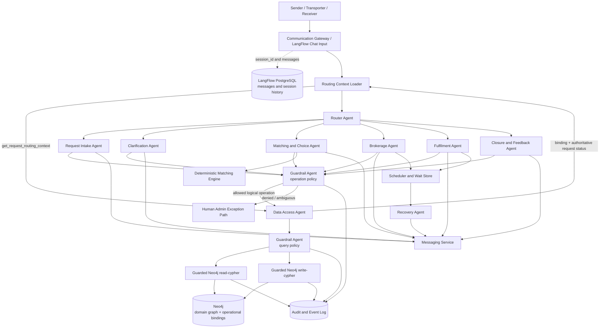

# Hulubul Agentic System Blueprint v0.3

## 1. Scope interpretation

This document describes the **target agentic-system architecture**. The incremental development strategy and phase-specific blueprints define which parts are implemented in each phase and which temporary simplifications apply. In particular, the Phase 1 Walking Skeleton consolidates several target agents, uses a seeded Transporter, omits guardrails, and implements only a narrow happy path.

### Included user-goal use cases

* **UC-1:** Register a parcel request
* **UC-3:** Match and choose a transporter
* **UC-4:** Forward request to a transporter
* **UC-5:** Respond to a transport request
* **UC-6:** Provide clarification or missing information
* **UC-7:** Plan pick-up and hand over the parcel
* **UC-8:** Coordinate and confirm delivery
* **UC-9:** Close request and collect feedback

The use cases describe a manually assisted V1, but also state that the Admin role can be replaced by the System or agents in the autonomous direction. This blueprint therefore treats a human Admin as an exception and observability path rather than making successful parcel intermediation depend on a human operator.

### Necessary dependencies from excluded use cases

Some behaviour from excluded use cases is still required internally:

| Deferred use case | Required dependency |
| --- | --- |
| UC-2 — Transporter preference | UC-3 may read an already-recorded preference, but the selected scope does not create, validate, or anonymously notify preferred Transporters. |
| UC-10 — Cascade | Rejection and timeout in UC-5 require selection of the next candidate. Implement this as an internal Brokerage Agent capability rather than a separately exposed use case. |
| UC-11 — Cancellation | The domain model contains `cancelled`; conversational cancellation handling remains deferred until its phase. |
| UC-13 — Party profile | UC-1 requires an identifiable Sender. Implement minimal Sender bootstrap while deferring full profile registration and maintenance. |
| UC-12 — Transporter profile | Matching assumes Transporter profiles, routes, and Channels already exist or are provided by the relevant profile-lifecycle phase. |

Note: the above UCs will most likely be reintroduced in the fourth Phase (HS).

# 2. Main conclusions from the use cases

## 2.1 Clarification is a shared capability with two distinct contexts

UC-6 covers two fundamentally different situations:

1. The System detects missing data while registering the request.
2. A Transporter asks for additional information after receiving the request.

The supplied `RequestStatus` model contains a single `needsClarification` value. The distinction must therefore be carried by an operational clarification context rather than by inventing separate domain statuses.

```text
Intake clarification:
new → needsClarification → complete

Transporter clarification:
waitingResponse → needsClarification → waitingResponse
```

A typed clarification record must identify its kind and resume status so that a Transporter question does not incorrectly restart matching.

## 2.2 UC-4 and UC-5 form a brokerage process

Forwarding a request, waiting, processing acceptance or rejection, asking for clarification, sending reminders, and moving to the next option belong to one cohesive area of expertise.

They should therefore be owned by one **Brokerage Agent**, not split between unrelated agents.

## 2.3 UC-7 and UC-8 form a fulfilment process

Pickup planning, parcel handover, delivery coordination, and delivery confirmation are contiguous phases of the same accepted transport.

They should initially be owned by one **Fulfilment Agent**.

## 2.4 UC-9 deserves a separate ownership boundary

Closing a request and collecting feedback are not transport coordination. Closure requires:

* verification that delivery is confirmed;
* historical retention;
* closure audit;
* optional feedback handling.

A small **Closure and Feedback Agent** provides a cleaner boundary. In the supplied domain model, closure is represented by setting `DeliveryRequest.closed`; `closed` is not a `RequestStatus` value.

## 2.5 Matching must produce a reusable candidate queue

UC-3 allows the Sender to select or rank options, while UC-5 may later require moving to another option.

The matching result therefore needs a persistent operational candidate queue:

```text
candidate_order =
    sender-defined ranking, when supplied
    otherwise:
    selected candidate first + original system ranking for the remainder
```

The Brokerage Agent consumes this queue without rerunning matching after every rejection. The candidate queue is an operational structure unless it is later incorporated into the conceptual domain model.

---

# 3. Target agent inventory

## Primary agents

1. **Router Agent**
2. **Request Intake Agent**
3. **Clarification Agent**
4. **Matching and Choice Agent**
5. **Brokerage Agent**
6. **Fulfilment Agent**
7. **Closure and Feedback Agent**
8. **Recovery Agent**
9. **Data Access Agent**
10. **Guardrail Agent**

This is the target decomposition, not a requirement that every phase use every agent or perform a separate model invocation for each responsibility. Earlier phases may consolidate target agents into narrower LangFlow subflows.

---

# 4. Target logical architecture



## Storage and routing responsibilities

* **LangFlow/PostgreSQL** stores conversation messages grouped by `session_id` and other LangFlow operational records.
* **Neo4j** stores the authoritative `DeliveryRequest` domain and lifecycle state.
* An explicitly operational `OperationalConversationBinding` associates a LangFlow `session_id` with the active `DeliveryRequest`. It is colocated in Neo4j for simple domain-grounded routing but is not part of the conceptual Hulubul JSON Schema.
* The Router receives a mandatory `get_request_routing_context` result before making a routing decision. Chat memory helps interpret the message, but Neo4j state determines the workflow stage.

## Important data-access boundary

Domain agents invoke **operation-oriented tools** implemented as LangFlow `Run Flow` calls to the Data Access flow:

```text
Domain Agent
  → typed logical operation tool
  → Data Access flow / Data Access Agent
  → mandatory guardrail stages
  → Neo4j MCP executor
  → Neo4j
```

In the target architecture, the Data Access Agent must not receive an unguarded write path that can bypass the Guardrail Agent. It produces a typed data-access plan; guarded read/write flows validate and execute it.

The Phase 1 Walking Skeleton is a deliberate temporary exception: it exposes `get-schema`, `read-cypher`, and `write-cypher` only to the Data Access Agent in a non-production development environment and introduces the LLM Guardrail Agent in Phase 2.

---

# 5. Use-case ownership matrix

| Use case | Primary conversational actor | Owning agent | Supporting agents/components |
| --- | --- | --- | --- |
| UC-1 Register request | Sender | Request Intake Agent | Clarification Agent, Data Access Agent |
| UC-3 Match and choose | Sender | Matching and Choice Agent | Matching Engine, Data Access Agent |
| UC-4 Forward request | System, with Admin exception handling | Brokerage Agent | Messaging Service, Data Access Agent |
| UC-5 Respond to request | Transporter | Brokerage Agent | Clarification Agent, Recovery Agent |
| UC-6 Provide clarification | Sender or Receiver | Clarification Agent | Intake Agent or Brokerage Agent as resumption owner |
| UC-7 Plan pickup and handover | Sender and Transporter | Fulfilment Agent | Messaging Service |
| UC-8 Coordinate and confirm delivery | Transporter, Receiver or Sender | Fulfilment Agent | Recovery Agent |
| UC-9 Close and collect feedback | System, with Admin exception handling | Closure and Feedback Agent | Data Access Agent, Messaging Service |

---

# 6. Domain-aligned state machine

The state machine below uses only values currently defined by `RequestStatus`. Matching, dispatch, candidate exhaustion, clarification type, and closure are represented as operations, events, or operational context rather than additional status values.

```mermaid
stateDiagram-v2
  [*] --> new: request created

  new --> needsClarification: intake data missing
  needsClarification --> complete: intake clarification resolved
  new --> complete: minimum data sufficient

  complete --> optionsProposed: matching completed and options recorded
  complete --> rejected: no candidates found

  optionsProposed --> waitingResponse: selected candidate received request

  waitingResponse --> accepted: transporter accepts
  waitingResponse --> needsClarification: transporter asks a question
  needsClarification --> waitingResponse: transporter clarification resolved

  waitingResponse --> rejected: rejection or timeout
  rejected --> waitingResponse: next candidate received request
  rejected --> [*]: candidates exhausted; closed timestamp set

  accepted --> pickUpPlanned: pickup details agreed
  pickUpPlanned --> pickedUp: handover confirmed
  pickedUp --> delivered: delivery confirmed
  delivered --> [*]: closed timestamp set

  new --> cancelled: sender cancels
  needsClarification --> cancelled: sender cancels
  complete --> cancelled: sender cancels
  optionsProposed --> cancelled: sender cancels
  waitingResponse --> cancelled: sender cancels
  accepted --> cancelled: policy permits cancellation
  cancelled --> [*]: closed timestamp set
```



## State and operational semantics

### Matching

`matching` is an operation or event, not a value in the current `RequestStatus` enum. A request remains `complete` while matching runs and becomes `optionsProposed` when candidates are recorded.

### Dispatch

`sentToTransporter` is an operational dispatch stage, not a domain status. The request becomes `waitingResponse` only after the selected candidate has received the request according to the configured channel-delivery policy.

### Clarification

`needsClarification` is shared by intake and Transporter clarification. A typed operational clarification case records:

* clarification type;
* requested items;
* requesting actor;
* owning agent;
* resume status;
* optional deadline.

### Rejection and no match

`rejected` represents a failed active candidate attempt. If another candidate remains, Brokerage advances the queue and returns the request to `waitingResponse` after successful delivery. If no candidates remain, an operational outcome such as `NO_MATCH` is recorded and `DeliveryRequest.closed` is set.

### Delivery and closure

`delivered` is the final successful `RequestStatus`. Closure is represented by `DeliveryRequest.closed != null`. Feedback may be collected after closure without reopening the operational request.

---

# 7. Domain event catalogue

Agents request domain or operational events; they do not directly invent target statuses.

| Event | Source `RequestStatus` | Status effect | Authorized origin |
| --- | --- | --- | --- |
| `REQUEST_CREATED` | None | `new` | Request Intake Agent |
| `REQUEST_DATA_INCOMPLETE` | `new` | `needsClarification` | Request Intake Agent |
| `REQUEST_COMPLETED` | `new`, intake `needsClarification` | `complete` | Request Intake Agent after completeness check |
| `MATCHING_STARTED` | `complete` | unchanged | Matching and Choice Agent |
| `MATCHES_FOUND` | `complete` | `optionsProposed` | Matching and Choice Agent |
| `NO_MATCHES_FOUND` | `complete` | `rejected`, then closed with `NO_MATCH` outcome | Matching and Choice Agent |
| `CANDIDATE_SELECTED` | `optionsProposed`, `rejected` | unchanged | Sender or Brokerage policy |
| `CANDIDATE_DISPATCH_STARTED` | `optionsProposed`, `rejected` | unchanged | Brokerage Agent |
| `TRANSPORTER_MESSAGE_DELIVERED` | `optionsProposed`, `rejected` | `waitingResponse` | Messaging delivery callback or trusted confirmation |
| `TRANSPORTER_ACCEPTED` | `waitingResponse` | `accepted` | Selected Transporter |
| `TRANSPORTER_REJECTED` | `waitingResponse` | `rejected` | Selected Transporter |
| `TRANSPORTER_RESPONSE_TIMED_OUT` | `waitingResponse` | `rejected` | Recovery policy |
| `TRANSPORTER_REQUESTED_CLARIFICATION` | `waitingResponse` | `needsClarification` with Transporter clarification context | Selected Transporter |
| `TRANSPORTER_CLARIFICATION_DELIVERED` | Transporter `needsClarification` | `waitingResponse` | Clarification Agent after updated summary delivery |
| `NEXT_CANDIDATE_SELECTED` | `rejected` | unchanged until delivery | Brokerage Agent |
| `CANDIDATES_EXHAUSTED` | `rejected` | status unchanged; closed timestamp and `NO_MATCH` outcome recorded | Brokerage Agent |
| `PICKUP_DETAILS_AGREED` | `accepted` | `pickUpPlanned` | Sender or selected Transporter |
| `PARCEL_HANDOVER_CONFIRMED` | `pickUpPlanned` | `pickedUp` | Selected Transporter, optionally Sender |
| `DELIVERY_CONFIRMED` | `pickedUp` | `delivered` | Transporter, Receiver or Sender according to policy |
| `REQUEST_CLOSED` | `delivered` | status unchanged; `closed` timestamp set | Closure and Feedback Agent |
| `REQUEST_CANCELLED` | Permitted active statuses | `cancelled` and `closed` timestamp set | Sender; policy-dependent after acceptance |

---

# 8. Agent specifications and tools

## 8.1 Router Agent

### Responsibility

The Router Agent determines:

* which parcel request the message concerns;
* which pending interaction it answers;
* which specialist agent should process it;
* whether disambiguation is necessary.

The Router does not retrieve domain state opportunistically. Before it runs, a mandatory routing-context step resolves the `OperationalConversationBinding` and loads the authoritative request context from Neo4j.

A representative routing context is:

```json
{
  "session_id": "session-id",
  "request_id": "request-id-or-null",
  "request_status": "waitingResponse",
  "closed": false,
  "assigned_transporter_id": "agent-id-or-null",
  "clarification_type": "TRANSPORTER_QUESTION",
  "next_expected_role": "sender"
}
```

Conversation memory may help interpret phrases such as “yes” or “tomorrow morning”, but it must not be the authority for the request status or workflow stage.

### Mandatory pre-routing context operations

| Operation | Purpose |
| --- | --- |
| `resolve_channel_actor` | Map a trusted channel identity to an Agent and role context. |
| `get_request_routing_context` | Resolve the session/request binding and load authoritative `DeliveryRequest` status, closure, assignment, and pending operational context. |
| `resolve_reply_reference` | Correlate a reply with the outbound message that prompted it when the channel supports reply identifiers. |

These are deterministic or data-access preprocessing steps, not optional Router tools.

### Router tools

| Tool | Purpose |
| --- | --- |
| `route_to_intake` | Invoke the Request Intake Agent flow. |
| `route_to_clarification` | Invoke the Clarification Agent flow. |
| `route_to_matching` | Invoke the Matching and Choice Agent flow. |
| `route_to_brokerage` | Invoke the Brokerage Agent flow. |
| `route_to_fulfilment` | Invoke the Fulfilment Agent flow. |
| `route_to_closure` | Invoke the Closure and Feedback Agent flow. |
| `ask_request_disambiguation` | Ask which request the user means when deterministic context cannot identify one. |

### Restrictions

The Router receives no raw Neo4j MCP tools and no state-changing tools.

---

## 8.2 Request Intake Agent

### Use-case ownership

* UC-1
* System-detected branch of UC-6

### Responsibility

* understand the parcel-sending intention;
* resolve or minimally bootstrap the Sender;
* create a draft request immediately;
* extract request information into structured fields;
* check completeness;
* request missing information;
* complete the request when the completeness rule passes.

### Tools

Every real persistence operation delegates to the Data Access flow and Data Access Agent.

| Tool | Purpose |
| --- | --- |
| `resolve_sender_profile` | Find the Sender Agent associated with the trusted actor context. |
| `create_minimal_sender_profile` | Create only the minimum Agent and Sender participation required for UC-1. |
| `create_request_draft` | Create the `DeliveryRequest` and required related nodes with status `new`; create the operational session binding when applicable. |
| `get_request_snapshot` | Retrieve the current request and relevant related objects. |
| `extract_request_fields` | Produce a typed partial request from the Sender message. |
| `update_request_fields` | Submit changed request information through the Data Access flow. |
| `store_attachment_reference` | Associate a photo or file reference with the relevant `Parcel` when attachments are supported. |
| `evaluate_minimum_data` | Determine whether the current phase's minimum-data rule is satisfied. |
| `open_clarification_case` | Create an intake clarification context and request the `REQUEST_DATA_INCOMPLETE` event. |
| `request_completion` | Request the `REQUEST_COMPLETED` event after completeness validation. |
| `send_message` | Ask for missing data or confirm completion. |

### Minimal Sender bootstrap

```text
No Sender Agent:
  create the minimum Agent + Sender participation needed to own the request

Incomplete Sender profile:
  collect only information required by the current phase

Full profile maintenance:
  deferred to UC-13
```

---

## 8.3 Clarification Agent

### Use-case ownership

* UC-6
* Shared by UC-1 and UC-5

### Responsibility

The Clarification Agent manages a typed operational clarification case:

```json
{
  "clarification_id": "clarification-id",
  "request_id": "request-id",
  "type": "INTAKE_MISSING_DATA | TRANSPORTER_QUESTION",
  "requested_by": "system-or-transporter-id",
  "requested_items": [],
  "resume_owner": "intake_agent | brokerage_agent",
  "resume_status": "complete | waitingResponse",
  "target_transporter_id": "optional",
  "deadline": "optional"
}
```

### Tools

| Tool | Purpose |
| --- | --- |
| `get_clarification_case` | Retrieve the outstanding questions and clarification type. |
| `extract_clarification_answers` | Map the response to requested items. |
| `update_request_fields` | Add answers to the same `DeliveryRequest`. |
| `store_attachment_reference` | Store references to supplied photos or documents. |
| `evaluate_minimum_data` | Recheck completeness for intake clarification. |
| `build_updated_transporter_summary` | Rebuild the summary for a Transporter question. |
| `send_updated_summary` | Send the answer to the selected Transporter through the Messaging Service. |
| `close_clarification_case` | Mark the operational clarification context as resolved. |
| `request_resume_event` | Request `REQUEST_COMPLETED` or `TRANSPORTER_CLARIFICATION_DELIVERED`. |
| `send_message` | Ask follow-up questions or acknowledge completion. |

### Important routing rule

```text
INTAKE_MISSING_DATA:
  answer → completeness check → complete

TRANSPORTER_QUESTION:
  answer → updated summary delivered → waitingResponse
```

---

## 8.4 Matching and Choice Agent

### Use-case ownership

* UC-3

### Responsibility

* initiate matching;
* request eligible Transporters from the matching engine;
* present up to three options;
* explain the recommendations;
* capture Sender selection or ranking;
* persist the operational candidate queue;
* hand control to the Brokerage Agent.

### Tools

| Tool | Purpose |
| --- | --- |
| `get_matching_context` | Retrieve route, parcel, date, urgency, preference, and usable profile information. |
| `run_transporter_matching` | Execute deterministic eligibility and ranking logic. |
| `save_match_result` | Persist candidate IDs, ordering, scores, and reason codes in the operational model. |
| `get_presentable_candidate_details` | Return only candidate information the Sender is allowed to see. |
| `record_sender_candidate_order` | Store the Sender's selection or ranking. |
| `build_candidate_queue` | Produce the order the Brokerage Agent should consume. |
| `request_matching_event` | Request `MATCHING_STARTED`, `MATCHES_FOUND`, or `NO_MATCHES_FOUND`. |
| `start_brokerage` | Invoke Brokerage after selection. |
| `send_message` | Present options and request selection or ranking. |

### Matching tool output

```json
{
  "request_id": "request-id",
  "options": [
    {
      "candidate_id": "candidate-id",
      "transporter_id": "transporter-role-id",
      "channel_ids": ["channel-id"],
      "system_rank": 1,
      "eligibility": "ELIGIBLE",
      "reason_codes": [
        "EXPRESSED_PREFERENCE",
        "RELEVANT_ROUTE",
        "PAST_EXPERIENCE",
        "DATE_COMPATIBLE"
      ],
      "score": 0.91
    }
  ]
}
```

The final scoring formula can remain undecided, but eligibility and ranking remain outside the agent prompt.

---

## 8.5 Brokerage Agent

### Use-case ownership

* UC-4
* UC-5
* Transporter-originated branch of UC-6
* Minimum cascade behaviour required by UC-5

### Responsibility

* consume the candidate queue;
* build the request summary;
* select a usable Channel;
* forward the request;
* monitor delivery;
* process acceptance, rejection, or questions;
* schedule reminders and deadlines;
* move to the next candidate after rejection or timeout;
* notify the Sender.

### Tools

| Tool | Purpose |
| --- | --- |
| `get_candidate_queue` | Retrieve ordered candidates and prior attempt results. |
| `select_current_candidate` | Select the next unused candidate. |
| `get_usable_channels` | Retrieve validated Channels for the candidate. |
| `build_transporter_request_summary` | Produce the scoped summary using the same Request ID. |
| `forward_request_to_transporter` | Send the request through the Messaging Service. |
| `record_dispatch_attempt` | Record channel, summary version, and timestamp. |
| `schedule_response_deadline` | Create a reminder and final response deadline. |
| `cancel_response_deadline` | Cancel the wait after acceptance, rejection, or question. |
| `record_transporter_response` | Record acceptance, rejection, or clarification request. |
| `open_clarification_case` | Create a `TRANSPORTER_QUESTION` clarification context. |
| `select_next_candidate` | Advance through the existing candidate queue. |
| `request_brokerage_event` | Request dispatch, acceptance, rejection, timeout, or exhaustion events. |
| `notify_sender` | Inform the Sender about acceptance, rejection, delay, or no match. |
| `create_admin_exception_task` | Escalate channel failure, contradictory responses, or policy exceptions. |

### Admin exception path

The autonomous path sends through the configured gateway. A human Admin is introduced only when delivery cannot be confirmed, the response is contradictory, or policy requires review. The blueprint does not require a formal configurable `AUTOMATED` versus `ADMIN_ASSISTED` runtime mode unless that remains a product requirement.

### Channel delivery rule

The request becomes `waitingResponse` only after the selected Transporter's Channel has successfully received the request according to the configured delivery semantics. Dispatch initiation and retry attempts are operational events, not `RequestStatus` values.

---

## 8.6 Fulfilment Agent

### Use-case ownership

* UC-7
* UC-8

### Responsibility

* record pickup coordination;
* record pickup planning;
* record handover confirmation;
* record delivery notes;
* accept delivery confirmation from authorized participants;
* notify relevant parties;
* follow up when confirmation is missing.

Detailed coordination may happen directly between Sender and Transporter. The system records the minimum operational information required by the use cases.

### Tools

| Tool | Purpose |
| --- | --- |
| `get_fulfilment_context` | Retrieve the accepted request, participants, and current status. |
| `record_pickup_plan` | Store place, time, and contact person using the agreed domain/operational mapping. |
| `record_pickup_note` | Store coordination notes communicated through Hulubul. |
| `record_handover_confirmation` | Record Transporter or Sender confirmation of receipt. |
| `record_delivery_note` | Record delivery-related information. |
| `record_delivery_confirmation` | Record confirmation and confirming actor. |
| `get_visible_party_channel` | Retrieve contact information allowed at the current stage. |
| `schedule_pickup_followup` | Schedule follow-up if handover is not confirmed. |
| `schedule_delivery_followup` | Schedule follow-up if delivery is not confirmed. |
| `request_fulfilment_event` | Request pickup, handover, or delivery events. |
| `notify_participants` | Notify Sender and optionally Receiver or Transporter. |
| `create_admin_exception_task` | Escalate disputed or indefinitely unconfirmed delivery. |

### Delivery confirmation policy

UC-8 allows confirmation from:

* Transporter;
* Receiver;
* Sender.

The confirmation must record:

```json
{
  "confirmed_by_actor_id": "agent-id",
  "confirmed_by_role": "transporter | receiver | sender",
  "confirmation_channel": "channel-id-or-medium",
  "confirmed_at": "timestamp"
}
```

Whether every role can independently confirm delivery or whether some confirmations require corroboration remains a policy decision.

---

## 8.7 Closure and Feedback Agent

### Use-case ownership

* UC-9

### Responsibility

* verify that delivery has been validly confirmed;
* set the request's `closed` timestamp;
* retain history;
* optionally request feedback;
* record feedback without reopening the operational process.

### Tools

| Tool | Purpose |
| --- | --- |
| `get_closure_context` | Retrieve delivery confirmation and unresolved exceptions. |
| `validate_closure_preconditions` | Check whether closure is allowed. |
| `set_request_closed_timestamp` | Set `DeliveryRequest.closed` while leaving status `delivered`. |
| `send_feedback_request` | Ask the Sender for optional feedback. |
| `record_feedback` | Store `Feedback` or an internal note. |
| `record_closure_summary` | Persist the final outcome and relevant timestamps. |
| `create_admin_exception_task` | Escalate incomplete or contradictory delivery evidence. |

### Recommended sequence

```text
Delivery confirmed
  → persist delivered
  → notify Sender
  → validate closure
  → set DeliveryRequest.closed
  → optionally request feedback
```

Feedback is a post-closure interaction and must not keep the parcel request operationally open.

---

## 8.8 Recovery Agent

### Responsibility

The Recovery Agent handles scheduled work rather than ordinary inbound messages.

It supports:

* unanswered intake clarification;
* unanswered Transporter clarification;
* Transporter response reminder;
* Transporter response timeout;
* automatic candidate cascade;
* pickup follow-up;
* delivery-confirmation follow-up.

### Tools

| Tool | Purpose |
| --- | --- |
| `get_due_wait_conditions` | Retrieve processes with due reminders or deadlines. |
| `get_recovery_policy` | Load timeout and reminder configuration. |
| `record_recovery_attempt` | Atomically increment the recovery count. |
| `send_reminder` | Send a context-specific reminder. |
| `expire_wait_condition` | Mark a waiting period as expired. |
| `request_recovery_event` | Request a timeout, rejection, or cascade event. |
| `invoke_owning_agent` | Resume Brokerage, Clarification, or Fulfilment. |
| `create_admin_exception_task` | Escalate after the configured limit. |

### Restriction

The Recovery Agent does not invent arbitrary recovery policy.

```text
Deadline reached:
  deterministic policy selects remind, cascade, or escalate

Recovery Agent:
  formulates the contextual message and invokes the prescribed action
```

---

## 8.9 Data Access Agent

### Responsibility

The Data Access Agent:

* understands the approved Neo4j schema;
* translates typed logical operations into parameterized Cypher plans;
* uses Neo4j MCP only through the configured phase-specific boundary;
* translates Neo4j results into typed domain/operational results;
* never communicates directly with end users.

Domain agents call operation-oriented tools that delegate to the common Data Access flow. They do not call Neo4j or MCP directly.

### Target tools available to the Data Access Agent

| Tool | Purpose |
| --- | --- |
| `get_schema_snapshot` | Retrieve the approved schema description, backed by Neo4j MCP `get-schema` when needed. |
| `submit_guarded_read_plan` | Submit a scoped, parameterized read plan to the guarded read flow. |
| `submit_guarded_write_plan` | Submit a scoped, parameterized write plan to the guarded write flow. |
| `validate_result_shape` | Validate Neo4j results against the expected operation schema. |
| `record_data_access_audit` | Record purpose, query hash, actor scope, and result metadata. |

The official Neo4j MCP capabilities relevant to this architecture are `get-schema`, `read-cypher`, and `write-cypher`. The raw MCP tools live inside the data-access boundary. `list-gds-procedures` is not required for the defined workflows.

### Tools not available to domain agents

* raw Neo4j MCP;
* unrestricted `read-cypher`;
* unrestricted `write-cypher`;
* database administration;
* hard deletion;
* index or constraint creation;
* arbitrary schema mutation.

### Data operation contract

```json
{
  "operation_id": "RECORD_TRANSPORTER_RESPONSE",
  "mode": "WRITE",
  "requested_by_agent": "brokerage_agent",
  "actor": {
    "id": "agent-id",
    "role": "transporter"
  },
  "resource": {
    "type": "DeliveryRequest",
    "id": "request-id",
    "expected_status": "waitingResponse"
  },
  "business_event": "TRANSPORTER_ACCEPTED",
  "payload": {},
  "idempotency_key": "inbound-message-id"
}
```

The Data Access flow also supports operational reads such as `get_request_routing_context(session_id)` by joining `OperationalConversationBinding` with the associated `DeliveryRequest`.

---

## 8.10 Guardrail Agent

### Phase placement

The Guardrail Agent is part of the target decomposition but is intentionally omitted from the Phase 1 Walking Skeleton. It is introduced as a mandatory LLM-based stage in Phase 2 and progressively replaced by deterministic policy and operation-specific tools in the hardened target system.

### Responsibility

The initial Guardrail Agent evaluates:

* whether the calling agent may request the operation;
* whether the actor may perform it;
* whether the actor is related to the request;
* whether the current status permits the requested event;
* whether the requested fields are in scope;
* whether the generated Cypher matches the approved logical operation;
* whether the read would disclose unrelated data;
* whether idempotency and expected-status information are present.

### Two-stage use

#### Stage 1: operation policy

```text
Specialist agent
  → typed logical operation request
  → Guardrail Agent
  → allow, deny, or require review
```

#### Stage 2: query policy

```text
Allowed operation
  → Data Access Agent creates a Cypher plan
  → Guardrail Agent validates the plan
  → conditional MCP executor runs the approved query
```

The Guardrail Agent is a mandatory sequential stage, not an optional tool that the Data Access Agent may skip.

### Guardrail tools

| Tool | Purpose |
| --- | --- |
| `load_authoritative_status` | Read the current `RequestStatus` and closure state. |
| `load_actor_relationship` | Verify ownership, assignment, or participation. |
| `get_operation_policy` | Retrieve allowed agents, roles, fields, and graph scope. |
| `get_transition_policy` | Retrieve allowed source status, event, and status effect. |
| `validate_operation_schema` | Check required fields and types. |
| `analyze_cypher` | Detect unrestricted matches, prohibited labels, deletes, and unparameterized values. |
| `check_idempotency` | Detect an already-processed message or event. |
| `record_guardrail_decision` | Persist the decision and reason codes. |

### Guardrail decision

```json
{
  "decision": "ALLOW | DENY | REQUIRE_REVIEW",
  "operation_id": "RECORD_TRANSPORTER_RESPONSE",
  "reason_codes": [
    "CALLER_ALLOWED",
    "ACTOR_IS_SELECTED_TRANSPORTER",
    "STATUS_TRANSITION_ALLOWED",
    "QUERY_SCOPE_VALID"
  ],
  "constraints": {
    "request_id": "request-id",
    "expected_status": "waitingResponse",
    "maximum_affected_records": 1
  }
}
```

### Deterministic controls around the LLM guardrail

Once guarded data access is introduced, the following remain deterministic even while semantic policy is evaluated by an agent:

* trusted actor-context injection;
* operation-name allowlist;
* JSON Schema validation;
* query timeout;
* result-size limit;
* parameterized Cypher;
* request-ID scoping;
* prohibition of `DELETE` and `DETACH DELETE`;
* expected-status comparison;
* idempotency-key enforcement;
* maximum affected-record count;
* separate read and write database credentials.

The LLM Guardrail Agent is temporary semantic policy assistance, not the sole security boundary.

---

# 9. Permission model derived from the use cases

| Action | Sender | Selected Transporter | Other Transporter | Receiver | System/Admin exception path |
| --- | ---: | ---: | ---: | ---: | ---: |
| Create request | Yes | No | No | No | Exception only |
| Update request during intake | Yes | No | No | Limited contribution | Exception only |
| View proposed options | Yes | No | No | No | Yes |
| Select or rank options | Yes | No | No | No | Exception only |
| View forwarded request summary | No | Yes | No | No | Yes |
| Accept or reject request | No | Yes | No | No | No |
| Ask package clarification | No | Yes | No | No | Exception only |
| Provide package clarification | Yes | No | No | Limited | Exception only |
| Plan pickup | Yes | Yes | No | No | Exception only |
| Confirm handover | Optional | Yes | No | No | Exception only |
| Add delivery details | Limited | Yes | No | Yes | Exception only |
| Confirm delivery | Policy-dependent | Yes | No | Yes | Exception only |
| Set closed timestamp | No | No | No | No | System; Admin on exception |
| Provide feedback | Yes | Possibly later | No | Possibly later | No |

“Selected Transporter” means the Transporter participation associated with the currently active candidate attempt, not any Transporter returned by matching.

---

# 10. LangFlow flow design

Use native LangFlow components and patterns before introducing custom components:

* Chat Input and Chat Output;
* Agent with structured response;
* Run Flow in Tool Mode for specialist and Data Access delegation;
* MCP Tools inside the Data Access boundary;
* Parser and JSON Operations for deterministic rendering and extraction;
* If-Else for simple guarded branches;
* built-in `session_id` and PostgreSQL-backed message history.

Custom components should be added only where native components cannot express a required deterministic constraint cleanly.

## Suggested target flow inventory

```text
LF-00 Inbound Router
LF-10 Request Intake
LF-15 Clarification
LF-20 Matching and Choice
LF-30 Brokerage
LF-40 Fulfilment
LF-50 Closure and Feedback
LF-60 Recovery
LF-70 Data Access
LF-71 Guarded Neo4j Read
LF-72 Guarded Neo4j Write
LF-90 Admin Exception
```

## LF-00 — Inbound Router

```text
Chat Input / gateway input
  → resolve trusted actor and reply context
  → Run Flow LF-70: get_request_routing_context(session_id, optional request_id)
  → Router Agent with authoritative domain context
  → Run selected specialist flow
  → structured result
  → Parser
  → Chat Output / gateway response
```

The routing-context lookup is mandatory preprocessing, not an optional Router tool. The LangFlow conversation history can be supplied to the Router for language understanding but does not determine the business stage.

## LF-10 — Request Intake

```text
AgentTaskEnvelope
  → Request Intake Agent
       tools:
         Run Flow LF-70: Data Access operations
  → structured AgentResult
  → deterministic validation and branch
  → Chat Output / flow result
```

## LF-15 — Clarification

```text
AgentTaskEnvelope + clarification context
  → Clarification Agent
  → Run Flow LF-70 for request updates
  → branch by clarification type
       intake: completeness check
       transporter: rebuild and deliver updated summary
  → request resume event
  → structured result
```

## LF-20 — Matching and Choice

```text
complete DeliveryRequest
  → Matching and Choice Agent
  → deterministic matching component/service
  → persist operational candidates
  → present up to three options
  → record Sender order
  → invoke Brokerage
```

## LF-30 — Brokerage

```text
candidate queue
  → Brokerage Agent
  → build summary
  → deliver through Messaging Service
  → process delivery callback
  → start response deadline
  → process accept, reject, clarification, timeout, or failure
  → advance candidate or invoke Fulfilment
```

## LF-40 — Fulfilment

```text
accepted request
  → Fulfilment Agent
  → record pickup plan
  → record handover
  → record delivery notes
  → record delivery confirmation
  → invoke Closure flow
```

## LF-50 — Closure and Feedback

```text
delivered request
  → validate closure
  → set DeliveryRequest.closed
  → send optional feedback request
  → record optional feedback
```

## LF-60 — Recovery

```text
scheduled trigger
  → load due wait condition
  → apply deterministic recovery policy
  → Recovery Agent generates contextual action/message
  → resume owning flow or escalate
```

## LF-70 — Data Access

```text
typed DataOperationRequest
  → operation-policy guard
  → Data Access Agent produces parameterized read/write plan
  → guarded read or write flow
  → validate result shape
  → typed DataOperationResult
```

Phase 1 temporarily omits the guard stages inside this flow while preserving the same external request/result contract.

## LF-71/LF-72 — Guarded Neo4j access

```text
Cypher plan
  → Guardrail Agent
  → deterministic hard checks
  → If-Else
       allow: MCP Tools component executes read-cypher or write-cypher
       deny: structured denial
  → audit
```

The raw Neo4j MCP components live only inside the data-access boundary. Domain agents receive the Data Access flow as an operation-oriented tool, not MCP tools.

## Structured outputs

Every Agent flow returns an enforced schema. A general target envelope is:

```json
{
  "result_type": "USER_REPLY | ACTION_PROPOSED | ACTION_COMPLETED | WAITING | DENIED | ERROR",
  "user_reply": "optional",
  "requested_event": "optional",
  "operations": [],
  "next_owner": "optional",
  "wait_condition": "optional",
  "reason_codes": []
}
```

A single structured model result should be deterministically rendered through Parser and Chat Output rather than generating a separate free-text Agent response. Schema validation is followed by deterministic business validation before side effects are executed.

---

# 11. Target-level decisions still to finalize

These decisions are required by the relevant later phases, but most are not blockers for the Phase 1 Walking Skeleton.

### Final minimum-data rule

Define the full completion rule for UC-1, including which Sender, Receiver, parcel, location, date, and special-handling fields are mandatory.

### Matching rules

Define:

* eligibility rules;
* weighting;
* route compatibility;
* urgency handling;
* treatment of invalid or unvalidated Channels;
* whether past experience is Sender-specific or global.

### Candidate selection semantics

When the Sender selects only one option rather than ranking all options, decide whether remaining candidates retain the system ranking or require another Sender choice. The recommended default is to retain the system ranking.

### Response timing

Define reminder delay, final timeout, reminder count, cascade behaviour, and handling of late acceptance.

### Admin exception boundary

Define which failures and policy conflicts require human intervention. Do not introduce a formal Admin-assisted runtime mode unless it remains a product requirement.

### Confirmation authority

Define who may confirm pickup and delivery, whether corroboration is needed, and how contradictory confirmations are handled.

### Channel delivery semantics

Define what counts as successful request delivery to a Transporter: provider acceptance, delivery callback, read receipt, or another trusted signal.

### Attachments

Define supported types, size, storage, scanning, model access, and retention.

### Feedback

Define questions, rating scale, eligible participants, and whether feedback affects matching.

---

# 12. Implementation alignment

Implementation order is governed by `hulubul-incremental-system-development-strategy.md`, while this document remains the target architecture reference:

1. **Walking Skeleton:** UC-1 intake, domain-grounded routing, structured outputs, Data Access Agent + Neo4j MCP, seeded Transporter, simulated communication, durable process completion, and automated tests.
2. **Working Brokerage:** split specialist agents, candidate choice, rejection, clarification, fallback, and mandatory LLM Guardrail Agent.
3. **Field Pilot:** real gateway, trusted identity mapping, multiple requests, session isolation, recovery, delivery callbacks, and pilot reliability.
4. **Hardened Service:** deterministic authorization and guardrails, operation-specific write tools, full selected/deferred use cases, resilience, privacy, and scale.

Verification requirements evolve in parallel according to `verification-testing-and-evaluation-strategy.md`.
