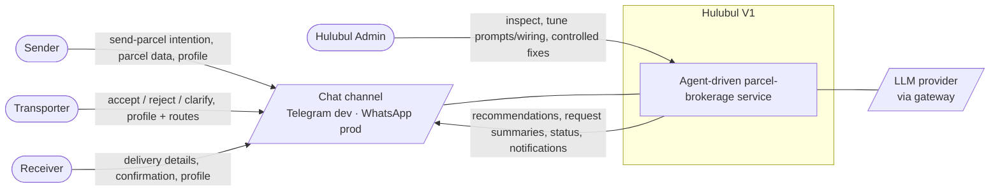
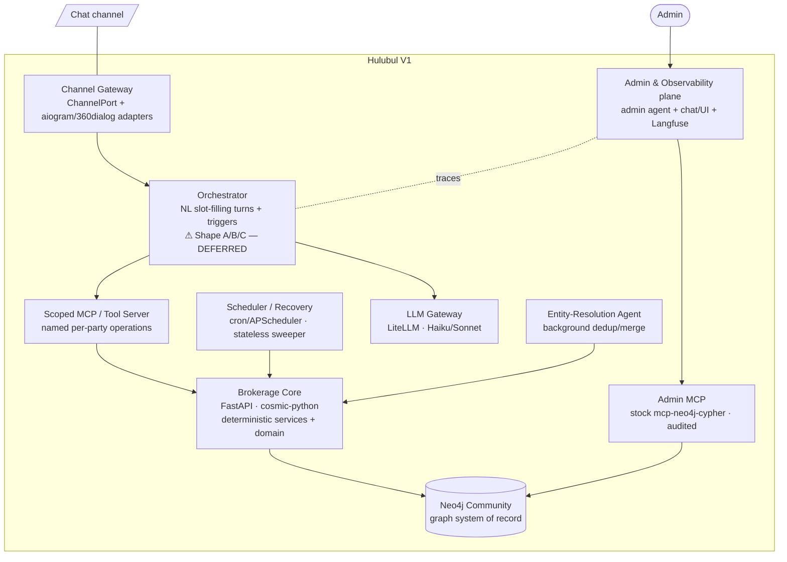
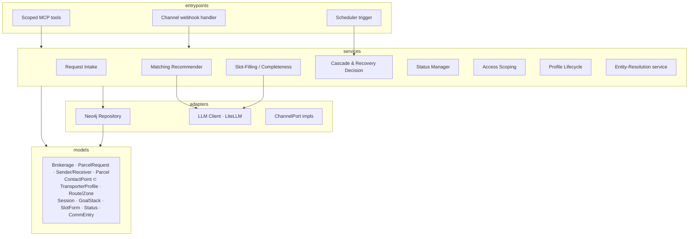

# Hulubul V1 — Architecture Statement (DRAFT v2)

Status: consolidated for the **autonomous agent-driven** direction. Grounded in
`project-statement.md` (v0.4) and the ADRs in `decisions/`. Technology is named where
settled by `task-2-frameworks-exploration.md`; the **orchestrator choice (Shape
A/B/C) is deliberately parked** and drawn as a single box.

## 1. Architectural drivers

| Driver | Source | Consequence |
|--------|--------|-------------|
| Central object is the **brokered connection** around a Parcel Request | ADR-001 | Graph models parties, routes, requests, sessions; matching traverses it. |
| **Chat-first** — Telegram dev, WhatsApp prod | ADR-003/008 | Channel behind one `ChannelPort`; structured state never lives only in chat. |
| **Autonomous** — no operator on success paths | ADR-004 | Agents drive every happy path; humans only via the admin plane. |
| **Deterministic core outside the LLM** | ADR-012/017 | Matching + guarded writes are tested Python, not LLM-authored. |
| **Low-code/UI-first**, minimal Meaningfy-compliant code | ADR-016 | Orchestration in a low-code tool; core in cosmic-python. |
| **Neo4j Community** — no in-engine access control | ADR-005/015 | Per-party scoping enforced in-app via a custom scoped MCP. |
| **Slot-filling** dialogue, mandatory-field validation | ADR-018 | No planner/BDI; forms + a simple goal stack. |
| **Proactive/scheduled** messaging dominates | task-2 §0 | A stateless scheduler over Neo4j state drives recovery + notifications. |

## 2. System context (C4 L1)

**Externally visible services:** register a parcel request · self-manage a profile
(all three actor types) · recommend/match transporters · forward request to a
transporter · track status · coordinate pick-up & delivery · close request ·
(admin) inspect & intervene.

## 3. Containers (C4 L2)

Tech-informed; the **Orchestrator** is the one parked choice.

| Container | Responsibility | Tech (settled) |
|-----------|----------------|----------------|
| **Channel Gateway** | One `ChannelPort`; provider adapters; template/opt-in/window accounting (WhatsApp) | aiogram (Telegram), 360dialog (WhatsApp) |
| **Orchestrator** | NL slot-filling turns, routing, trigger wiring | **⚠ Shape A/B/C parked** |
| **Brokerage Core** | Request lifecycle, slot-filling/completeness, matching, cascade/recovery decisions, status, access scoping, profile lifecycle | FastAPI, cosmic-python |
| **Scoped MCP / Tool Server** | Party-facing **named, per-party-scoped** operations over Core services; party id bound server-side | custom, over Core |
| **Admin MCP** | Elevated, audited graph access for the admin agent | stock `mcp-neo4j-cypher` |
| **Neo4j Community** | Graph system of record (parties, requests, contacts, routes, sessions, status, comms) | Neo4j Community |
| **Scheduler / Recovery** | Stateless sweep of due conversations; nudges (3-cap), notifications | cron/APScheduler + Neo4j state |
| **LLM Gateway** | Provider-swappable model access | LiteLLM (Haiku/Sonnet) |
| **Admin & Observability** | Inspect/tune prompts & wiring, controlled fixes, tracing | admin agent + chat/UI + Langfuse |
| **Entity-Resolution Agent** | Background dedup/merge; human-friendly confirm | ADR-013 |

## 4. Components — Brokerage Core (C4 L3, cosmic-python layers)

**Layer direction (enforced by import-linter):** `entrypoints → services → models`
and `adapters → models`; models import nothing upward. Tools/MCP are the
**entrypoints** layer (ADR-016). LLM access is an `adapter` (DIP) — the deterministic
services never embed a model call.

- **Request Intake** — create/update Parcel Request, assign ID, identify/create Sender.
- **Slot-Filling / Completeness** — model-driven forms; enforce mandatory fields before matching (ADR-018); LLM extracts slot values, validation is deterministic.
- **Matching Recommender** — favourite → that; else top-3 by past experience/preference/route/urgency (ADR-012); deterministic, unit/property-tested.
- **Cascade & Recovery Decision** — pure function over conversation state → next action; nudges (3-cap), advance, close (ADR-010); invoked by the stateless sweep.
- **Status Manager** — owns the request state machine (`diagrams/workflows.md`).
- **Access Scoping** — injects the per-party visibility rule (own pact + public info of prior contacts) on every read; backs the Scoped MCP (ADR-015).
- **Profile Lifecycle** — register/maintain Sender/Receiver/Transporter profiles + routes; Contact Point ⊂ Transporter Profile (ADR-002/009).
- **Entity-Resolution service** — candidate-pair detection + safe reversible merges (ADR-013).

## 5. Core information objects

Brokerage (central) · Parcel Request · Sender · Receiver · Parcel · Contact Point
(⊂ Transporter Profile) · Route/Zone · Session/Goal · Communication Entry. Status
model in `diagrams/workflows.md`. **Formal LinkML schema is deferred to the modelling
session** (see `specs/`).

## 6. What is parked / deferred

- **Orchestrator Shape A/B/C** — `task-2-frameworks-exploration.md` §7 (parked by decision).
- **Data model detail, scoped-MCP operation catalogue, access-visibility rules, dialogue-act naming subset** — modelling session.
- **WhatsApp consent / paid-template / GDPR model** — prod-cutover workstream.
