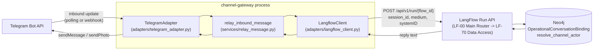

# Channel Gateway Blueprint

Design reference for the Telegram/WhatsApp channel gateway: the `ChannelPort` interface,
the `TelegramAdapter`, the `WhatsAppAdapter` stub, session/identity handling, module layout,
and deployment topology. Elaborates [ADR-003](decisions/README.md#adr-003--channel-abstracted-messaging-telegram-dev-whatsapp-prod-l1)
and [ADR-008](decisions/README.md#adr-008--channel-gateway-with-per-provider-adapters-l2) into
a concrete, buildable design.

For the operational how-to (bot setup, local bring-up, running tests), see the companion
[channel-gateway-runbook.md](channel-gateway-runbook.md).

## Context

Hulubul's target architecture already decided, at ADR level, that party interaction is
channel-abstracted — Telegram in dev/test, WhatsApp in prod — behind one `ChannelPort`
interface with per-provider adapters (ADR-003, ADR-008). A prior exploration
([task-2-frameworks-exploration.md](task-2-frameworks-exploration.md)) picked aiogram 3.x for
Telegram and 360dialog for WhatsApp, and ruled out unofficial WhatsApp APIs (WAHA and similar)
on ToS/ban-risk grounds. None of that had actually been built: Phase 1's Walking Skeleton runs
with no real channel at all — a test harness injects trusted actor context in its place (see
[agentic-system-blueprint-phase-1.md](agentic-system-blueprint-phase-1.md)).

Session and request routing already live inside LangFlow, not in any gateway. `LF-00 Main
Router` and `LF-70 Data Access` run `getRequestRoutingContext(session_id)` and
`resolve_channel_actor(medium, systemID)` as mandatory preprocessing ahead of the Router Agent,
backed by Neo4j's `OperationalConversationBinding(sessionId, activeRequestId)`. That keeps the
gateway's job narrow by design: own the channel connection, derive a `session_id`, attach a
trusted channel identity, call LangFlow, relay the reply back — not reimplement routing.

This work is **Phase 3 (Field Pilot)** territory per
[incremental-system-development-strategy.md §6](incremental-system-development-strategy.md#6-phase-3---field-pilot),
explicitly marked "prepare later" relative to the OpenSpec change actually in flight at the time
this gateway was built (`deliver-phase-1-request-intake-thread`, Phase 1 scope). It was pulled
forward deliberately, ahead of Phase 1 finishing, to de-risk the Phase 3 channel cutover — not
to redirect Phase 1 work. Readers should treat this blueprint as describing a real, working
subsystem that nonetheless sits outside the currently active Phase 1 change.

## Non-Goals

Explicit boundaries this change does not cross, from `design.md`'s `## Goals / Non-Goals`:

- **Redesigning `OperationalConversationBinding` for concurrent requests per channel** —
  documented as a forward-looking design note only (see D4); implementation stays
  single-active-request.
- **Cross-channel identity merge** (unifying a person's Telegram and WhatsApp `Channel`s) —
  phone number is not a valid join key for this (Telegram's `systemID` is `chat_id`, not a
  phone number), and no merge mechanism is designed here.
- **Live WhatsApp integration** (360dialog account/BSP onboarding, template/opt-in
  accounting) — `WhatsAppAdapter` stays a `NotImplementedError` stub proving the `ChannelPort`
  interface fits (D3), not a working adapter.
- **Running live-Telegram tests in CI** — the e2e suite against a real Telegram test bot is
  local/manual-only (D8).
- **Any change to LF-00/LF-70, the Neo4j domain schema, or existing Phase 1 flows** — the
  gateway calls LangFlow's Run API as a client; it does not modify routing logic upstream of
  it.

## Architecture overview

The gateway is a standalone process, not a LangFlow component. It owns the Telegram
connection, normalizes inbound updates, calls LangFlow's Run API as a plain HTTP client, and
relays the reply back over the same channel it arrived on. LangFlow — not the gateway — resolves
the trusted channel identity into a real `Channel` graph node and does all session/routing work.



The `WhatsAppAdapter` is not in this diagram's live path — it implements the same
`ChannelPort` interface but has no wired send/receive logic yet (see D3 and
[Non-Goals](#non-goals)).

## Decisions

### D1 — External gateway process, not a LangFlow-native component

**Choice**: a standalone process owns the Telegram connection and calls LangFlow's Run API as
a plain HTTP client, rather than a LangFlow Component wired to LangFlow's own webhook trigger.

**Rationale**: this shape lets a mature bot framework (aiogram) own Telegram-specific concerns
— secret-token validation, retries, rate limits — instead of hand-rolling them as flow
components. It's also the only shape that supports one shared `ChannelPort` interface across
channels; LangFlow-native components would each be separate, non-abstracted flow nodes with no
enforced common contract.

**Rejected alternative**: a LangFlow-native component. Telegram quirks would still have to be
hand-rolled per flow, and outbound replies need an explicit side-effecting `sendMessage` call
regardless (Telegram doesn't treat the webhook response itself as the reply) — so the
LangFlow-native shape doesn't actually avoid that complexity, it just loses the shared
interface.

### D2 — aiogram 3.x for the Telegram adapter

**Choice**: aiogram 3.x, per the earlier `task-2-frameworks-exploration.md` decision.

**Rationale**: modern async-first library with native polling and webhook support, actively
maintained.

**Rejected alternative**: `python-telegram-bot`. Used by the one working prior-art example
(`fauzaanu/langflow-bot`) and also viable, but adopting it here would reverse the earlier
framework decision without a concrete reason to.

### D3 — `ChannelPort` interface with a WhatsApp stub, not a full second adapter

**Choice**: define `ChannelPort` now; implement `TelegramAdapter` fully; implement
`WhatsAppAdapter` as a stub that matches the interface shape (360dialog payload structure) but
raises `NotImplementedError` on its `send`/`receive` bodies.

**Rationale**: proves the interface actually generalizes to WhatsApp without paying the cost of
building real 360dialog integration, template/opt-in accounting, and WhatsApp-specific testing
before any of that is needed.

**Rejected alternatives**: interface-only, no stub — doesn't prove the interface actually fits.
A full second adapter — premature scope, since WhatsApp isn't on the near roadmap.

### D5 — One gateway container hosting all channel adapters

**Choice**: a single service/Dockerfile (sibling to `mcp-neo4j` in `infra/docker-compose.yaml`)
hosts both the Telegram adapter (polling or webhook, per `GATEWAY_MODE`) and the WhatsApp stub,
behind the shared `ChannelPort` interface.

**Rationale**: simpler to deploy and reason about than per-channel containers; matches the
interface design. WhatsApp isn't live code yet, so fault isolation between channels isn't a
real concern today.

**Rejected alternative**: one container per channel. Better fault isolation, but doubles the
deployment surface for no current need. Revisit if a real scaling or blast-radius reason
emerges.

### D6 — Local dev supports both polling and webhook mode, via an ngrok tunnel

**Choice**: `GATEWAY_MODE=polling|webhook`. Webhook mode adds an `ngrok` service to the local
Compose stack so the production code path is exercisable locally, not just polling.

**Rationale**: polling alone needs no inbound port and would be the cheaper default, but the
explicit preference was to exercise webhook mode locally rather than defer it to a future real
deployment. ngrok was chosen over cloudflared based on prior use in another project — the two
are otherwise equivalent quick-tunnel options.

**Rejected alternative**: polling-only for local dev, webhook deferred to a future real
deployment. Rejected in favor of testing the real code path locally.

### D7 — Module layout follows cosmic-python layering strictly

See [Module layout](#module-layout) below for the resulting file tree, and
[Session/identity handling](#sessionidentity-handling) for the `ChannelRef`-vs-`Channel`
correction this decision produced.

**Choice**: strict cosmic-python layering — `adapters/` for repositories/gateways/clients,
`services/` for orchestration with no I/O of its own, `models/` for pure domain logic with no
I/O, `entrypoints/` for the process wiring.

**Rationale**: per the `cosmic-python` skill's canonical layers, `adapters/` implements
"repositories, gateways, clients" and depends only on `models/`; `services/` orchestrates
models and adapters and owns no I/O of its own; `models/` is pure domain logic with no I/O. The
LangFlow Run API client and `session_id` derivation were initially mis-placed in `services/`
during the first design pass and were corrected against this catalogue.

**Rejected alternative**: naming the entrypoint `aiogram_bot.py`, following the cosmic-python
book's convention of naming entrypoints after their concrete technology (`flask_app.py`,
`redis_eventconsumer.py`). Rejected in favor of `telegram_bot.py`, keeping the aiogram/SDK
choice an implementation detail hidden behind the stable channel concept rather than exposed in
the module name.

### D8 — Three-tier test suite (unit / feature / e2e), CI runs unit + feature only

**Choice**:
- `tests/unit/` — models and adapters with mocks, nothing real; always in CI.
- `tests/features/*.feature` (Gherkin, pytest-bdd) plus `tests/feature/` step-definitions — real
  local LangFlow container, synthetic inbound payloads, no real Telegram; traces back to a use
  case in `architecture/use-cases/` per the `bdd-gherkin` skill; runs in CI.
- `tests/e2e/` — real Telegram test bot plus real local LangFlow, full local stack up;
  local/manual only, excluded from CI. Covers both the full round-trip and a Telegram-only
  isolation scenario (LangFlow response stubbed) as sub-cases within this suite rather than a
  fourth top-level category.

**Rationale**: matches the preferred three-category taxonomy while still covering all four
dependency states (LangFlow × Telegram, connected/disconnected) from the original brainstorm;
reuses the existing `tests/features/` Gherkin convention and `pytest-bdd` dependency already in
the repo; avoids adding a Telegram bot-token secret to CI.

**Rejected alternative**: running live-Telegram tests in CI with a bot-token secret. Rejected —
secret management, flakiness, and rate-limit exposure for no current need.

### D9 — Relocate LinkML→Pydantic generation into an importable domain package

**Choice**: `make pydantic`'s output moves from `model/generated/pydantic/hulubul_models.py` to
`src/hulubul/core/models/domain/hulubul_models.py` — still fully generated (never hand-edited, a
banner in the new package's `__init__.py` states this), still regenerated by the same
`make pydantic` target, just written somewhere the `hulubul` package can actually import from.

**Rationale**: `model/generated/pydantic/` is not part of the installed `hulubul` package —
`pyproject.toml`'s `packages` list only includes `src/hulubul` — so nothing under `src/hulubul/`
could import the generated domain models (`Channel`, `Medium`, etc.) without a path hack. That
gap is what had pushed earlier hand-written code toward duplicating concepts that already exist
in LinkML, rather than reusing them — including this change's own first-draft `Medium` enum
redefinition in `channel_gateway/models/message.py`, which only had `TELEGRAM`/`WHATSAPP` and
was missing `GSM`/`Viber`/`email` from the real enum. Fixing the import path is a prerequisite
for `ChannelRef` and `InboundMessage` to reuse the real `Medium` enum instead of redefining a
second, smaller one.

**Rejected alternatives**: leaving the generated output where it was and importing it via a
`sys.path` hack (matching how `tests/conftest.py` already adds `src/` to `sys.path`) — rejected
as a workaround that wouldn't fix the underlying unreachability for any other future consumer,
just this one call site. Scoping the relocation as its own separate change was considered, but
the gateway is the first real consumer that needs it, and deferring would mean building
`ChannelRef`/`Medium` reuse against an import path that doesn't exist yet.

**Scope boundary**: only the `pydantic` generation target moves. OWL/SHACL/JSON
Schema/diagrams/Cypher/neomodel outputs stay under `model/generated/`, untouched. The
single-file output (`hulubul_models.py`, one file for the whole merged schema) is also kept
as-is — splitting into one generated file per LinkML module is a further, separate improvement
not taken on here.

## Session/identity handling

### D4 — Single-active-request session binding, concurrent-request design deferred

**Choice**: `session_id` is derived locally and deterministically as `f(medium, systemID)`; the
gateway is built against the current, Phase-1-only `OperationalConversationBinding` shape (one
active request per channel at a time).

**Rationale**: this equivalence holds correctly for sequential channel reuse — a request
closes, the binding frees, the next message rebinds — which is the common case. It breaks only
for concurrent requests on one channel, which is explicitly out of scope for Phase 1's binding
shape and is flagged in `incremental-system-development-strategy.md` §3.1/§6.1 as needing its
own future redesign. A mechanism is already named for that later work — deterministic reply
correlation via `resolve_reply_reference`, falling back to `ask_request_disambiguation` — but
the actual Phase 3 replacement binding shape is not specified anywhere yet.

**Rejected alternative**: redesigning the binding now. Rejected as disproportionate scope for a
gateway-focused change; it would also touch the Neo4j schema and `LF-00`/`LF-70` flow logic well
beyond the gateway's boundary.

**Consequence for implementation**: `session_id` stays a pure function of channel identity
only, never of request state — see `derive_session_id(medium, system_id)` in
`models/channel.py`, and the Anti-Patterns table in `design.md` (deriving `session_id` from
anything other than `(medium, systemID)` silently breaks routing continuity).

### `ChannelRef` vs. `Channel` — why the gateway never constructs a `Channel`

The first design pass named the gateway's local value object `Channel(medium, system_id)`. That
collided with the name of the real business entity already modeled in
`model/linkml/hulubul_channel.yaml`. Two checks were run against the actual generated class
(`Channel(id, description, alias, systemID, email, telephone, hasMedium, validationStatus)`),
not just a naming judgment call:

1. **`validationStatus` is required, but doesn't block reuse on its own.** The gateway does know
   the correct value at message-receipt time — per an already-decided rule that an inbound
   message is itself proof of control, the gateway would always construct
   `validationStatus=valid`. Not a blocker by itself.
2. **`id` is required, and it is the graph node identity** — "distinct from any business
   identifier" — which is meaningless before the node is persisted in Neo4j. The gateway cannot
   supply it honestly: minting a fake placeholder risks colliding with a real node's id once
   `resolve_channel_actor` runs its lookup, and taking over id-assignment from
   `resolve_channel_actor` entirely would be a materially bigger change than scoped here. **This
   is the actual blocker** — a full `Channel` genuinely cannot be constructed pre-persistence.

The fix was to rename the local type to `ChannelRef`: an identity/reference value object (the
`(medium, systemID)` natural key only), distinct from the full `Channel` entity it refers to —
the standard DDD pattern of `CustomerId` vs. `Customer`, not a duplicate model. The real
`Channel`, with a real `id` and `validationStatus`, is only ever constructed where a graph node
backs it — inside `resolve_channel_actor`, downstream of the gateway. `Channel` remains reserved
exclusively for the LinkML-generated entity; nothing in this change adds to or regenerates the
LinkML schema itself.

This is the part of the design most likely to be re-litigated later (it's tempting to have the
gateway construct a full `Channel` once it "knows enough"): the reasoning above is the answer —
`id` is not something the gateway can ever know honestly, by construction, regardless of how
much other data it holds.

## Module layout

```
src/hulubul/channel_gateway/
  models/message.py         # InboundMessage/TextMessage/MediaMessage — pure value objects
  models/channel.py         # ChannelRef value object + derive_session_id(medium, systemID) — pure
  adapters/channel_port.py  # ChannelPort ABC — the interface adapters implement
  adapters/telegram_adapter.py  # TelegramAdapter(ChannelPort), aiogram-backed
  adapters/whatsapp_adapter.py  # WhatsAppAdapter(ChannelPort) stub — NotImplementedError on send/receive
  adapters/langflow_client.py   # LangFlow Run API client
  services/relay_message.py     # orchestrates adapter.receive() -> langflow_client.run() -> adapter.send()
  entrypoints/telegram_bot.py   # process entrypoint; wires aiogram Dispatcher -> services (polling or webhook via GATEWAY_MODE)

src/hulubul/core/models/domain/hulubul_models.py  # GENERATED (make pydantic), see D9 — Channel, Medium, etc.
```

Each layer depends only inward: `adapters/` depends on `models/`; `services/` depends on
`models/` and `adapters/`; `entrypoints/` wires everything together and holds no domain logic of
its own. `models/` has no I/O and no dependency on anything else in the package.

## Deployment topology

Container topology (D5) and connection mode (D6) are both design decisions; this section names
what they mean at the infrastructure level. The concrete commands for bringing the stack up
locally, switching modes, and registering the webhook live in the
[runbook](channel-gateway-runbook.md#local-compose-bring-up), not here.

- **One container, both channels.** A single `channel-gateway` service, built from a dedicated
  `infra/channel-gateway/Dockerfile`, sits alongside `langflow`, `postgres`, `neo4j`, and
  `mcp-neo4j` in `infra/docker-compose.yaml` — not one container per channel (D5).
- **Mode is an environment switch, not a code fork.** `GATEWAY_MODE=polling|webhook` selects
  aiogram's polling loop or its webhook server at process startup; both modes run the same
  `TelegramAdapter` and the same `relay_inbound_message` orchestration underneath (D6).
- **Webhook mode needs a public HTTPS URL even in local dev.** Telegram's webhook API requires a
  reachable HTTPS endpoint, which a laptop doesn't have by default — the local Compose stack
  adds an `ngrok` service for this so the real webhook code path is exercisable locally instead
  of only ever running polling (D6).
- **The gateway holds no persistence layer of its own.** Neo4j, via `resolve_channel_actor`,
  remains the only store of record — restarting or stopping the `channel-gateway` container has
  no state to unwind (see Migration Plan in `design.md`).

## Known limitations

The subsections below are copied in full from `design.md`'s `## Risks / Trade-offs` and
`## Open Questions` sections, so this blueprint carries the same caveats as the design record it
elaborates.

### Risks / Trade-offs

- [Risk] Single-active-request session binding will need rework once concurrent-request support
  lands (Phase 3 §6.1) → Mitigation: D4 documents the future shape as a design note now, so the
  gateway's `session_id` derivation and `ChannelPort` contract don't assume anything that would
  need to change (session_id stays a pure function of channel identity, not of request state).
- [Risk] Cross-channel identity merge (same person, Telegram + WhatsApp) has no mechanism — a
  future WhatsApp adapter will surface this gap in practice → Mitigation: explicitly out of
  scope here; flagged for its own design work before a real WhatsApp adapter ships.
- [Trade-off] One gateway container instead of per-channel containers trades fault isolation for
  simplicity → accepted because WhatsApp isn't live code in this change; revisit when it is.
- [Trade-off] Local webhook testing via ngrok adds a moving part (tunnel URL registration, ngrok
  account/session limits) to local dev → accepted per explicit user preference to exercise the
  real webhook code path, not just polling.
- [Risk] `WhatsAppAdapter` stub could silently drift out of sync with 360dialog's real payload
  shape since it's never exercised against a live endpoint → Mitigation: stub's structure should
  be reviewed against 360dialog's published webhook/API schema at design time, not just
  invented; flagged for the tasks breakdown.
- [Risk] The original reason `model/generated/pydantic/**` was excluded from
  `check-model-generated`'s staleness check (commit `7a4981e`) was not re-verified before
  relocating it (D9) → Mitigation: the new location keeps the same exclusion (no behavior
  change), so this isn't a new risk introduced by the move — but re-enabling the freshness check
  on the new path later requires first confirming `gen-pydantic`'s output is actually
  deterministic across runs, not assuming it now.
- [Risk] `Channel.id` (D9/D7) is Neo4j's graph node identity, assigned only at persistence — no
  code in this change mints or predicts it → Mitigation: `ChannelRef` deliberately never carries
  an `id`; the full `Channel` is constructed exclusively inside `resolve_channel_actor` where a
  real node backs it, so there is no code path where a fake/placeholder `id` could leak out as
  if it were real.
- [Risk] When LangFlow is unreachable or errors, the sender's message is silently unanswered — no
  fallback "we're having trouble" message is sent (Error Handling Matrix, User-Facing Errors) →
  Mitigation: none yet; this is a known, currently-accepted gap, not a resolved UX decision.
  Whether to add a fallback message is an open question (below), deliberately not decided here to
  avoid scope creep into LangFlow-side or gateway-side messaging policy.

### Open Questions

- Exact replacement data shape for `OperationalConversationBinding` under concurrent requests
  (Phase 3 scope, not this change) — remains unspecified anywhere in the architecture docs.
- Which use case(s) in `architecture/use-cases/` the `tests/feature/` Gherkin scenarios should
  trace back to — needs to be resolved when writing the actual `.feature` files (tasks phase),
  not here.
- Whether `WhatsAppAdapter`'s stub payload shape needs a real 360dialog API-doc review before
  being written, or can stay a best-effort placeholder until the real adapter is built.
- Whether the gateway should send a fallback user-facing message when LangFlow is unreachable
  (Error Handling Matrix, User-Facing Errors; Risks above) — currently the sender gets silence,
  which is an accepted gap, not a decision.

## References

- [../decisions/README.md#adr-003--channel-abstracted-messaging-telegram-dev-whatsapp-prod-l1](decisions/README.md#adr-003--channel-abstracted-messaging-telegram-dev-whatsapp-prod-l1) — ADR-003
- [../decisions/README.md#adr-008--channel-gateway-with-per-provider-adapters-l2](decisions/README.md#adr-008--channel-gateway-with-per-provider-adapters-l2) — ADR-008
- [../decisions/README.md#adr-019--generated-domain-models-land-in-an-importable-package-l2](decisions/README.md#adr-019--generated-domain-models-land-in-an-importable-package-l2) — ADR-019 (D9)
- [task-2-frameworks-exploration.md](task-2-frameworks-exploration.md) — Telegram/WhatsApp framework choice
- [agentic-system-blueprint-phase-1.md](agentic-system-blueprint-phase-1.md) §4 — `LF-00 Main Router`
- [agentic-system-blueprint.md](agentic-system-blueprint.md) §8.1 — target-architecture Router Agent
- [incremental-system-development-strategy.md](incremental-system-development-strategy.md) §6 — Phase 3 field pilot scope
- `openspec/changes/build-telegram-gateway/design.md` — full design record this blueprint summarizes
- `openspec/changes/build-telegram-gateway/brainstorm.md` — raw Q1–Q8 decision chain
- [channel-gateway-runbook.md](channel-gateway-runbook.md) — operational how-to
