# Phase 1 — Request Intake Sequence (LF-00 / LF-10 / LF-70)

Detailed, implementation-level sequence diagrams for the Change 1 / Phase 1
request-intake thread (`openspec/changes/deliver-phase-1-request-intake-thread/`),
covering the three LangFlow flows: **LF-00** (Main Router, the user-facing
facade), **LF-10** (Request Intake), and **LF-70** (Data Access, the only
flow with Neo4j/MCP access). For the higher-level, flow-agnostic V1 service
model see `workflows.md`; for the component/container view see
`../architecture-statement.md`.

## Intended design vs current implementation

Per the design intent (`openspec/changes/deliver-phase-1-request-intake-thread/design.md`,
DEC-014 and the LF-00 routing table), **LF-00 is meant to be the sole
user-facing facade**: the user only ever talks to the Router, which invokes
LF-10 as needed and relays whatever LF-10 produces (a clarification
question, a completion confirmation, etc.) back to the user. LF-10 has no
chat component of its own by design — it is never meant to be user-facing
directly.

**That relay does not currently exist.** `RouterResult`
(`src/hulubul/core/models/operational/routing.py`) has no field to carry
Intake's own response, and `render_router_result()`
(`src/hulubul/request_intake/services/rendering.py`) only ever emits the
Router's fixed, deterministic `safe_message` (e.g. `"routing to intake"`),
regardless of what Intake actually said. Confirmed live via LangFlow MCP
trace inspection: the Router genuinely calls the Intake Agent tool and
receives back a real clarification question (e.g. *"Who is the receiver?
Where should it be picked up? Where should it be delivered?"*), but that
text is discarded — only the fixed decision string reaches the user.

The diagrams below show the **intended** flow (what the design calls for,
and what makes the facade pattern coherent); the point where the current
implementation falls short of it is marked explicitly with a `Note` in each
diagram. Separately, per `openspec/changes/deliver-phase-1-request-intake-thread/tasks.md`
tasks 9.2/9.3, the *deployed* LF-10 prompt currently has its own bugs
independent of this gap (e.g. the partial-info branch is currently
instructed not to persist a sparse draft at all, and the complete-info
branch never transitions status to `complete`) — those are not re-derived
here; see tasks.md for the up-to-date status.

## A. New user, all required data given in one turn

```mermaid
sequenceDiagram
    actor User
    participant LF00 as LF-00 Router Agent
    participant LF70pre as LF-70 Data Access Agent<br/>(direct prefetch)
    participant Neo4j
    participant LF10 as LF-10 Intake Agent
    participant GraphIDs as Graph Identifiers Generator
    participant LF70tool as LF-70 Data Access Agent<br/>(as LF-10's tool)

    User->>LF00: "Send a parcel to Maria, pickup 12 Baker St,<br/>drop-off 45 Rue de Rivoli, small electronics gift"

    Note over LF00,Neo4j: Mandatory routing-context prefetch (deterministic, not an LLM tool call)
    LF00->>LF70pre: getRequestRoutingContext(session_id)
    LF70pre->>Neo4j: read_neo4j_cypher (binding lookup)
    Neo4j-->>LF70pre: no binding found
    LF70pre-->>LF00: routing_context{binding_state: absent, routing_stage: intake}

    Note over LF00: Router Agent (LLM) decision:<br/>binding absent → outcome=routed, target=intake, reason=noBinding

    LF00->>LF10: call Intake Agent tool<br/>(message + actor_id + session_id)

    Note over LF10: Intake Agent (LLM) extracts facts:<br/>receiver, pickup, drop-off, contents all present

    LF10->>GraphIDs: generate deterministic identifiers(actor_id, receiver, ...)
    GraphIDs-->>LF10: identifiers{request_id, sender_id, sender_agent_id, ...}

    LF10->>LF70tool: createDeliveryRequest(identifiers, facts)
    LF70tool->>Neo4j: write_neo4j_cypher (MERGE sender, CREATE request+binding, transaction)
    Neo4j-->>LF70tool: 1 row affected
    LF70tool->>Neo4j: read_neo4j_cypher (fetch created/updated timestamps)
    Neo4j-->>LF70tool: created, updated
    LF70tool-->>LF10: DataOperationResult{outcome: confirmed,<br/>request_id, status: new}

    LF10-->>LF00: IntakeResult{outcome: requestComplete,<br/>request_id, safe_user_message: "Your request has been created."}

    Note over LF00: Router notes outcome=requestComplete,<br/>carries request_id into its own RouterResult

    LF00->>LF00: build RouterResult{outcome: routed, target: intake,<br/>reason: noBinding, request_id, safe_message: "routing to intake"}

    rect rgb(80, 30, 30)
    Note over LF00,User: ⚠️ CURRENT GAP: Deterministic Renderer only emits the fixed<br/>safe_message ("routing to intake"), never Intake's own<br/>safe_user_message or a completion confirmation with the request_id.<br/>Intended: user sees something like "Your request req-xyz has been<br/>created and we'll start matching it with transporters."
    end

    LF00-->>User: "routing to intake"
```

## B. New user, required data given across two turns

```mermaid
sequenceDiagram
    actor User
    participant LF00 as LF-00 Router Agent
    participant LF70pre as LF-70 Data Access Agent<br/>(direct prefetch)
    participant Neo4j
    participant LF10 as LF-10 Intake Agent
    participant LF70tool as LF-70 Data Access Agent<br/>(as LF-10's tool)

    Note over User,LF70tool: ── Turn 1 — partial info ──
    User->>LF00: "I want to send a parcel to my friend."

    LF00->>LF70pre: getRequestRoutingContext(session_id)
    LF70pre->>Neo4j: read_neo4j_cypher (binding lookup)
    Neo4j-->>LF70pre: no binding found
    LF70pre-->>LF00: routing_context{binding_state: absent, routing_stage: intake}

    Note over LF00: reason=noBinding → outcome=routed, target=intake

    LF00->>LF10: call Intake Agent tool<br/>(message + actor_id + session_id)

    Note over LF10: Intake Agent (LLM) extracts facts —<br/>sender known, receiver/pickup/drop-off all MISSING

    Note over LF10,Neo4j: Intended: persist a sparse draft (binding + partial<br/>DeliveryRequest, status=needsClarification) so turn 2<br/>can resume it — this is what LF70tool below would do
    LF10-->>LF00: IntakeResult{outcome: clarificationRequired,<br/>clarification_field: "receiver_name",<br/>missing_fields: [receiver, pickup, drop-off],<br/>safe_user_message: "Who is the receiver? Where should it be<br/>picked up? Where should it be delivered?"}

    Note over LF00: Router notes outcome=clarificationRequired,<br/>request_id stays null (no completed request yet)

    LF00->>LF00: build RouterResult{outcome: routed, target: intake,<br/>reason: noBinding, request_id: null,<br/>safe_message: "routing to intake"}

    rect rgb(80, 30, 30)
    Note over LF00,User: ⚠️ CURRENT GAP (same as scenario A): Intake's actual<br/>clarification question is discarded. Intended: the user should<br/>see "Who is the receiver? Where should it be picked up? Where<br/>should it be delivered?" — instead they see the fixed decision string.
    end

    LF00-->>User: "routing to intake"

    Note over User,LF70tool: ── Turn 2 — remaining info, same session ──
    User->>LF00: "Receiver is Jane Doe, pickup 5 Main St,<br/>drop-off 10 Oak Ave"

    LF00->>LF70pre: getRequestRoutingContext(session_id)
    LF70pre->>Neo4j: read_neo4j_cypher (binding lookup)
    Neo4j-->>LF70pre: binding found, request status=needsClarification
    LF70pre-->>LF00: routing_context{binding_state: bound,<br/>request_status: needsClarification, routing_stage: intake}

    Note over LF00: binding bound + status in {new, needsClarification}<br/>→ outcome=routed, target=intake, reason=intakeInProgress

    LF00->>LF10: call Intake Agent tool<br/>(message + actor_id + session_id + existing request_id context)

    Note over LF10: Intake Agent resumes the existing sparse draft,<br/>merges new facts, confirms all critical fields now present

    LF10->>LF70tool: updateDeliveryRequest(request_id,<br/>expected_updated_at, expected_status, updates)
    LF70tool->>Neo4j: write_neo4j_cypher (compare-and-set update)
    Neo4j-->>LF70tool: 1 row affected
    LF70tool-->>LF10: DataOperationResult{outcome: confirmed, status: new}

    LF10->>LF70tool: setRequestStatus(request_id,<br/>expected_updated_at, expected_status: new,<br/>target_status: complete)
    LF70tool->>Neo4j: write_neo4j_cypher (status transition)
    Neo4j-->>LF70tool: 1 row affected
    LF70tool-->>LF10: DataOperationResult{outcome: confirmed, status: complete}

    LF10-->>LF00: IntakeResult{outcome: requestComplete, request_id,<br/>safe_user_message: "Your request has been created."}

    LF00->>LF00: build RouterResult{outcome: routed, target: intake,<br/>reason: intakeInProgress, request_id,<br/>safe_message: "request intake in progress"}

    rect rgb(80, 30, 30)
    Note over LF00,User: ⚠️ CURRENT GAP: same issue — the completion confirmation<br/>and request_id never reach the user through the fixed<br/>safe_message.
    end

    LF00-->>User: "request intake in progress"
```

## Sources

- `openspec/changes/deliver-phase-1-request-intake-thread/design.md` — DEC-014, LF-00 routing table
- `openspec/changes/deliver-phase-1-request-intake-thread/tasks.md` — sections 9 (LF-10) and 10 (LF-00), current implementation status
- `src/hulubul/request_intake/entrypoints/langflow/components/hulubul/deterministic_renderer.py`
- `src/hulubul/request_intake/services/rendering.py`
- `src/hulubul/core/models/operational/routing.py` (`RouterResult`)
- Live trace via LangFlow MCP `get_component_output` on `Agent-hlb-lf-00-router-v1`,
  merged demo flow `hulubul-merged-demo-single-flow` (2026-07-29)
