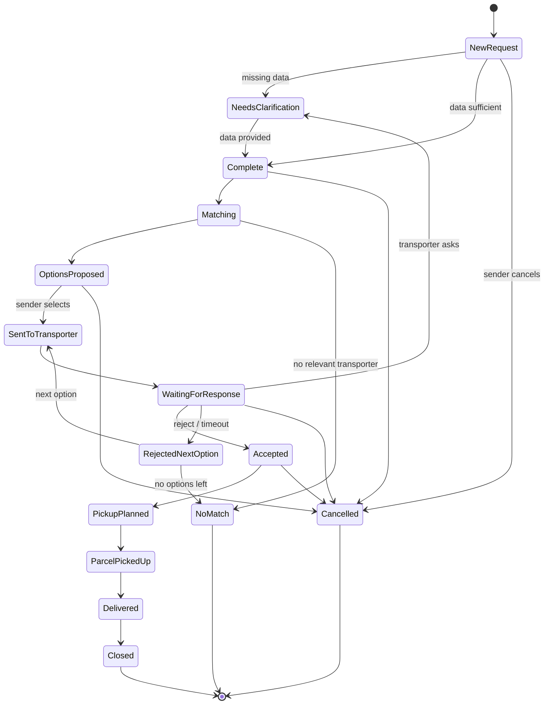
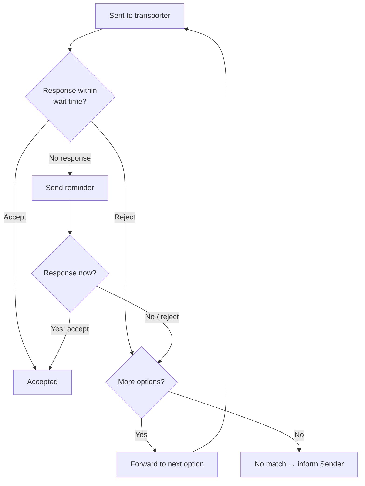

# Hulubul V1 — Workflow Diagrams (DRAFT)

Behaviour views. Structural (context/container/component) diagrams live in
`../architecture-statement.md`.

## 1. Parcel Request — status model (state machine)

Statuses from v0.4 §9. Operational control only, not logistics tracking.



## 2. Happy-path service flow (sequence)

```mermaid
sequenceDiagram
  actor S as Sender
  participant GW as Comms Gateway
  actor A as Admin
  participant C as Coordination Core
  participant G as Graph Store
  actor T as Transporter
  actor R as Receiver

  S->>GW: send-parcel intention + data
  GW->>A: relay
  A->>C: create request
  C->>G: persist request (ID, status=Complete)
  A->>C: run matching
  C->>G: traverse profiles/routes/preference
  C-->>A: up to 3 options
  A->>GW: options to Sender
  GW->>S: options
  S->>GW: choose option
  GW->>A: selection
  A->>C: forward to transporter (status=Sent/Waiting)
  A->>GW: request summary
  GW->>T: summary
  T->>GW: accept
  GW->>A: acceptance
  A->>C: record (status=Accepted)
  C->>G: update; notify
  Note over S,T: pick-up planned & handover (status=Parcel picked up)
  T->>R: coordinate & deliver
  T->>GW: delivery confirmation
  GW->>A: confirmation
  A->>C: status=Delivered → Closed
  C->>G: persist; retain history
```

## 3. Exception — rejection / no-response cascade (ADR-009)



Notes: wait time is configurable (ADR-009, proposed default 24h — confirm).
Cascade advancement is operator-triggered in V1.
