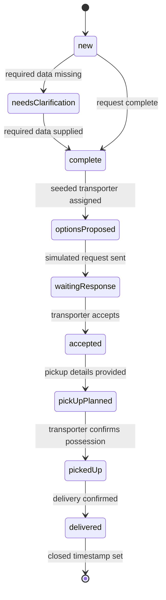

# Hulubul Incremental System Development Strategy

## 1. Purpose

This document defines how the Hulubul agentic system should be developed incrementally, starting with an end-to-end walking skeleton and gradually introducing business completeness, external communication, resilience, isolation, and deterministic controls.

The strategy is guided by one principle:

> Each phase should result in a complete, demonstrable system increment, even when parts of the business behaviour are deliberately simplified, simulated, fixed, or omitted.

The first phase is therefore not expected to implement UC-1 and UC-3–UC-9 completely. Instead, it implements one narrow happy-path slice that traverses the essential business lifecycle and exercises the critical architectural components.

The complete use cases remain the target business specification.

---

# 2. Envisioned phases

| Phase | Memorable name        | Main outcome                                                                                                                                                                       |
| ----- | --------------------- | ---------------------------------------------------------------------------------------------------------------------------------------------------------------------------------- |
| 1     | **Walking Skeleton**  | A parcel request can move from initial conversation to delivery and closure using LangFlow agents, persisted Neo4j process state, structured outputs, and simulated communication. |
| 2     | **Working Brokerage** | The flow supports meaningful business branches, specialist agents, simple transporter choice, clarification, rejection, and an initial LLM-based guardrail.                        |
| 3     | **Field Pilot**       | The system works through a real communication channel, supports identity and request correlation, handles timeouts and failures, and can be tested with real users.                |
| 4     | **Hardened Service**  | The target use cases are covered with deterministic authorization, deterministic guardrails, robust recovery, stronger matching, and production-grade isolation and observability. |

The boundaries are intentionally based on architectural risk rather than on implementing complete use cases one by one.

---

# 3. Cross-phase architectural commitments

Some design choices should remain stable from the first phase onward.

## 3.1 Neo4j owns business-process state

Neo4j should remain the authoritative source for:

* the `DeliveryRequest`;
* its current `RequestStatus`;
* Sender, Receiver, and Transporter participations;
* parcel and location information;
* the assigned Transporter;
* domain lifecycle timestamps.

The supplied domain schema already models these concepts.

LangFlow chat memory may help an agent understand the conversation, but it must not become the authoritative record of whether a request is accepted, picked up, or delivered.

## 3.2 LangFlow owns conversation history initially

LangFlow’s Agent component has built-in chat memory enabled by default. Messages are grouped by `session_id`, and LangFlow describes this built-in capability as sufficient for most ordinary agent-conversation use cases.

The existing PostgreSQL configuration is suitable for Phase 1: when LangFlow uses PostgreSQL as its application database, its flows, message history, logs, and other structured application data are stored there rather than in the default SQLite database.

Therefore:

```text
Neo4j:
  business entities and process state

LangFlow PostgreSQL:
  conversation messages
  session-grouped chat history
  flow definitions and application records
```

A separate custom conversation-history implementation is not needed initially.

## 3.3 All agent outputs are structured from Phase 1

Every agent must expose a defined structured-output schema.

User-facing text is one field in that result; it must not be the only result.

## 3.4 The Data Access Agent is the database boundary

Only the Data Access Agent receives Neo4j MCP tools.

Other agents request logical operations from it. They do not generate or execute Cypher directly.

## 3.5 Prefer native LangFlow components

The implementation should use native LangFlow capabilities before introducing custom components:

* Agent;
* MCP Tools;
* Run Flow;
* Chat Input;
* Chat Output;
* Parser;
* Structured Response;
* Structured Output;
* JSON Operations;
* If-Else.

Custom components should be introduced only when the required constraint cannot be represented cleanly through available components.

Component availability can differ between LangFlow versions, so the installed visual editor should be treated as the final source for the exact component catalogue.

---

# 4. Phase 1 — Walking Skeleton

## 4.1 Goal

Phase 1 proves this complete loop:

```text
Chat Input
  → Router Agent
  → specialist agent
  → Data Access Agent
  → Neo4j MCP
  → Neo4j process update
  → structured result
  → Chat Output
  → later message with the same session ID
  → process resumed
```

The phase is successful when a parcel request can move from creation to delivery and closure over several separate interactions, including after restarting LangFlow.

---

## 4.2 What is introduced

Phase 1 introduces:

* LangFlow Chat Input and Chat Output;
* custom `session_id`;
* LangFlow built-in Agent chat memory;
* Router Agent;
* Request Intake Agent;
* combined Parcel Coordination Agent;
* Data Access Agent;
* Neo4j MCP integration;
* structured outputs for every agent;
* persisted `DeliveryRequest` state in Neo4j;
* simplified Sender, Receiver, Parcel, location, and Transporter records;
* simulated communication shown in LangFlow chat;
* structured communication stubs;
* one complete happy-path scenario.

---

## 4.3 Limitations and assumptions

Phase 1 deliberately assumes:

* one parcel request per LangFlow session;
* one linear happy path;
* caller identity is trusted or simulated;
* actors may be simulated in the same Playground session;
* no session-level authorization or isolation;
* no Telegram;
* no real outbound communication;
* no real transporter matching;
* one configured, seeded Transporter;
* Transporter accepts;
* no rejection;
* no timeout;
* no automatic recovery;
* no Transporter clarification;
* no cancellation;
* no feedback;
* no attachments;
* no LLM guardrail;
* no robust compensation after partial failure;
* no event ledger beyond the current domain state and available execution/message logs.

These are explicit Phase 1 constraints, not intended target behaviour.

---

# 5. Phase 1 agent inventory

## 5.1 Router Agent

### Responsibility

The Router Agent determines whether the current message belongs to:

* request registration or clarification;
* later parcel coordination.

Because Phase 1 allows only one request per session, the Router does not need a sophisticated multi-goal resolver.

### LangFlow implementation

Use a standard **Agent** component with two specialist flows exposed through **Run Flow** components in Tool Mode:

```text
run_request_intake
run_parcel_coordination
```

LangFlow supports attaching other flows to an Agent as tools through the Run Flow component. The tool metadata is generated from the selected flow.

### Tools

| Tool                      | Implementation                     | Behaviour                                           |
| ------------------------- | ---------------------------------- | --------------------------------------------------- |
| `run_request_intake`      | Real LangFlow subflow              | Creates or completes a request.                     |
| `run_parcel_coordination` | Real LangFlow subflow              | Advances an existing request after completion.      |
| `read_request`            | Indirect, through Data Access flow | Retrieves the current request when its ID is known. |

The Router does not receive Neo4j MCP tools.

---

## 5.2 Request Intake Agent

### Responsibility

The Intake Agent:

1. extracts the minimum request information;
2. creates the request and required related entities;
3. identifies missing required information;
4. asks a focused clarification question;
5. updates the same request after clarification;
6. transitions the request to `complete`.

### Tools

| Tool                      | Implementation                                        | Behaviour                                           |
| ------------------------- | ----------------------------------------------------- | --------------------------------------------------- |
| `create_delivery_request` | Real Data Access operation                            | Creates the domain-model slice in Neo4j.            |
| `read_delivery_request`   | Real Data Access operation                            | Reads the request and related objects.              |
| `update_delivery_request` | Real Data Access operation                            | Adds information supplied in clarification.         |
| `set_request_status`      | Real Data Access operation                            | Updates the status with an expected current status. |
| `check_required_fields`   | Native structured output plus JSON Operations/If-Else | Checks the small Phase 1 required-field set.        |
| `ask_for_clarification`   | Agent result rendered through Chat Output             | Returns the next required question.                 |

No separate clarification agent is required in Phase 1.

---

## 5.3 Parcel Coordination Agent

### Responsibility

This deliberately consolidated agent temporarily owns:

* simplified transporter assignment;
* simulated forwarding;
* acceptance;
* pickup planning;
* pickup confirmation;
* delivery confirmation;
* closure.

It combines responsibilities that will later be split among Matching, Brokerage, Fulfilment, and Closure agents.

### Tools

| Tool                           | Implementation             | Behaviour                                           |
| ------------------------------ | -------------------------- | --------------------------------------------------- |
| `read_delivery_request`        | Real Data Access operation | Reads the request and its current status.           |
| `assign_seeded_transporter`    | Simplified real operation  | Assigns a predefined Transporter participation.     |
| `set_request_status`           | Real Data Access operation | Updates request lifecycle status.                   |
| `set_request_closed_timestamp` | Real Data Access operation | Sets `DeliveryRequest.closed`.                      |
| `emit_communication_stub`      | Structured agent output    | Represents a message that would be sent externally. |

There is no matching tool in Phase 1.

### Why a fixed Transporter is preferable to random selection

The current model contains Transporter profiles and transport-service concepts, but does not define a current-availability property. Randomly selecting an Agent would imply semantics that the model does not provide.

Phase 1 should instead use a configuration value such as:

```text
WALKING_SKELETON_TRANSPORTER_ID
```

The Data Access Agent retrieves that seeded Agent, creates or retrieves the relevant `Transporter` role participation, and links it through `DeliveryRequest.hasTransporter`.

Phase 2 can introduce random or first-eligible selection from a controlled candidate set. Phase 3 introduces actual matching.

---

## 5.4 Data Access Agent

### Responsibility

The Data Access Agent:

* inspects the Neo4j schema;
* converts logical operations into Cypher;
* performs reads and writes through Neo4j MCP;
* returns structured results;
* never produces a user-facing answer.

### Neo4j MCP tools

The official Neo4j MCP server exposes:

* `get-schema`;
* `read-cypher`;
* `write-cypher`;
* `list-gds-procedures`.

`read-cypher` rejects write, schema, administration, and profile operations. `write-cypher` permits arbitrary write Cypher and is explicitly cautioned for development use because LLM-generated queries can be harmful.

Phase 1 should expose only:

| MCP tool       | Use                                                              |
| -------------- | ---------------------------------------------------------------- |
| `get-schema`   | Let the Data Access Agent understand the actual graph structure. |
| `read-cypher`  | Read request and actor data.                                     |
| `write-cypher` | Create and update Phase 1 data.                                  |

`list-gds-procedures` is unnecessary.

### Phase 1 configuration

Use one write-enabled Neo4j MCP server connected to a development database.

This is acceptable only as a prototyping phase. Neo4j’s documentation itself recommends caution with `write-cypher` and limits this pattern to development environments.

### Tools exposed to domain agents

The domain agents do not see the MCP names. They see logical operations exposed by the Data Access flow:

```text
create_delivery_request
read_delivery_request
update_delivery_request
assign_transporter
set_request_status
set_request_closed_timestamp
```

Internally, the Data Access Agent decides whether to call `read-cypher` or `write-cypher`.

---

# 6. Phase 1 domain-model slice

The Phase 1 graph should use a subset of the supplied model rather than creating a separate prototype model.

## 6.1 Included types

### Required

* `Agent`
* `Sender`
* `Receiver`
* `Transporter`
* `DeliveryRequest`
* `Parcel`
* `Place`
* `RequestStatus`

### Seeded or reused

* one Transporter `Agent`;
* optionally the Transporter’s existing service-related records.

### Deferred

* `Channel`
* `TransportService`
* `ServiceOffer`
* `Feedback`
* `Address`
* `GeoCoordinates`
* detailed profile management.

The full supplied model remains authoritative, but Phase 1 creates only the graph portion needed by the walking skeleton.

---

## 6.2 Minimal request data

The `DeliveryRequest` schema requires:

* Sender participation;
* Receiver participation;
* current status;
* at least one delivery item;
* pickup location;
* drop-off location;
* created and updated timestamps.

A `Parcel` requires at least `id` and `declaredContent`. An `Agent` requires `id`, `name`, and `identifier`.

Therefore the Phase 1 minimum intake should be:

```text
Sender name or identifier
Receiver name or identifier
pickup location text
drop-off location text
parcel-content description
optional preferred period
```

### Simplified location representation

Use `Place`, rather than `Address`, because `Address` requires street, building number, postal code, and containing Area.

For free-text input such as “Warsaw” or “near the central station,” the system may create a simplified `Place`:

```json
{
  "id": "generated-id",
  "hasIdentifier": "generated-business-key",
  "hasType": "userProvidedLocation",
  "name": "Warsaw"
}
```

Exact address handling is deferred.

---

# 7. Phase 1 lifecycle aligned with the domain model

The earlier blueprint contained states not present in the supplied `RequestStatus` enumeration.

The domain model currently defines:

```text
new
needsClarification
complete
optionsProposed
waitingResponse
accepted
rejected
pickUpPlanned
pickedUp
delivered
cancelled
```

It does not define:

* `matching`;
* `sentToTransporter`;
* `closed`;
* `noMatch`;
* separate Transporter clarification.

Closure is represented through the nullable `DeliveryRequest.closed` timestamp rather than a `closed` status.

Phase 1 should therefore use the model as written:



### Interpretation of simplified states

* `optionsProposed` means that the configured Transporter has been selected as the single option.
* `waitingResponse` means the simulated communication stub was produced.
* `delivered` remains the final status.
* closure is represented by `closed != null`.

No new RequestStatus values should be introduced in Phase 1.

### Operational event names

Agents may still use stable operation names such as:

```text
REQUEST_CREATED
REQUEST_COMPLETED
TRANSPORTER_ASSIGNED
REQUEST_FORWARDING_SIMULATED
TRANSPORTER_ACCEPTED
PICKUP_PLANNED
PARCEL_PICKED_UP
DELIVERY_CONFIRMED
REQUEST_CLOSED
```

In Phase 1, these are operational operation identifiers, not additional domain entities.

A persisted domain-event ledger can be introduced in Phase 2 after deciding whether it belongs in the domain model or in a separate operational model.

---

# 8. Session state versus chat memory

These concepts should be distinguished explicitly.

## 8.1 Chat memory

Chat memory is the sequence of messages associated with a `session_id`.

It helps an LLM remember that:

* the user previously provided a destination;
* a request ID was created;
* the agent previously asked a clarification question;
* the Transporter previously accepted.

LangFlow provides this through Agent memory and Message History. Messages can be stored and retrieved by `session_id`.

## 8.2 Session ID

A session ID is primarily a partitioning and correlation key for chat messages.

It is not, by itself, a structured session-state object.

LangFlow propagates a custom API-provided `session_id` through downstream components that support it. When none is provided, it falls back to the flow ID, which would incorrectly group all interactions into one conversation.

Phase 1 must always use an explicit custom session ID.

## 8.3 Session state

Structured session state would contain information such as:

```text
active_request_id
current_actor_id
current_actor_role
pending_action
pending_question
last_owning_agent
```

LangFlow’s message history does not provide this as a general mutable key-value state object. It provides conversation messages grouped by session.

## 8.4 Phase 1 decision

Do not create a custom Session Context Resolver in Phase 1.

Instead:

* allow one request per session;
* include the request ID in every relevant agent response;
* let the Router use LangFlow chat memory to recover the ongoing context;
* read the authoritative current status from Neo4j;
* allow an explicit Request ID in test messages when needed.

This removes the previously proposed custom component.

### How far this approach can go

Built-in LangFlow memory should be sufficient for:

* one request per conversation;
* linear clarification;
* conversational continuity;
* Playground experiments;
* restarting LangFlow while retaining PostgreSQL;
* simple Router decisions.

A structured resolver will eventually be required for:

* multiple concurrent requests in one conversation;
* multiple actors using different channels;
* deterministic correlation of a reply to a pending action;
* authorization;
* session isolation;
* avoiding reliance on the LLM to infer the active Request ID;
* switching between suspended goals.

That resolver should therefore be considered a Phase 2 or Phase 3 capability, not a Phase 1 prerequisite.

---

# 9. Simulated communication in LangFlow chat

The communication stub can appear in both requested places:

1. as a visible message in LangFlow chat;
2. as structured operational output.

## 9.1 Structured communication schema

```json
{
  "request_id": "request-id",
  "message_type": "transport_request",
  "from_role": "system",
  "to_role": "transporter",
  "to_actor_id": "transporter-id",
  "message_text": "A parcel request is available...",
  "delivery_mode": "simulated",
  "simulated_delivery_status": "delivered"
}
```

## 9.2 LangFlow wiring

The specialist agent should produce only a Structured Response.

Then:

```text
Structured Response
  ├── retained as structured flow output
  └── Parser
        → Chat Output
```

The Parser converts the structured result into a visible chat message such as:

```text
[Simulated message to Transporter T-001]

Request DR-001:
Parcel from Warsaw to Chisinau.
Please reply whether you accept.
```

Chat Output can accept JSON or structured data, convert it into Message data, display it in the Playground, and store it in message history.

### Why not connect both Agent outputs

LangFlow’s Agent component exposes both `response` and `structured_response`, but connecting both causes two separate LLM calls.

The preferred pattern is therefore:

```text
one structured LLM result
  → structured output for the system
  → deterministic rendering for the chat
```

This avoids inconsistent duplicate generation.

---

# 10. Phase 1 operational schemas

The supplied schema describes the conceptual domain model. The following schemas describe exchanges between LangFlow agents and flows.

They should be kept separate from the Hulubul domain schema.

## 10.1 RouterResult

```json
{
  "target_agent": "requestIntake | parcelCoordination | unsupported",
  "request_id": "string or empty",
  "actor_role": "sender | transporter | receiver | system",
  "routing_reason": "string",
  "user_message": "string",
  "error_code": "string or empty"
}
```

## 10.2 IntakeResult

```json
{
  "result_type": "clarificationRequired | requestComplete | failure",
  "request_id": "string",
  "current_status": "new | needsClarification | complete",
  "missing_fields": ["string"],
  "user_message": "string",
  "next_expected_actor": "sender",
  "next_expected_action": "provideMissingData | none",
  "error_code": "string or empty",
  "error_message": "string or empty"
}
```

## 10.3 CoordinationResult

```json
{
  "result_type": "actionCompleted | waitingForInput | failure",
  "operation": "assignTransporter | simulateForwarding | acceptRequest | planPickup | confirmPickup | confirmDelivery | closeRequest | none",
  "request_id": "string",
  "previous_status": "string",
  "current_status": "string",
  "user_message": "string",
  "next_expected_actor": "sender | transporter | system | none",
  "next_expected_action": "string",
  "communication_type": "string or empty",
  "communication_recipient": "string or empty",
  "communication_text": "string or empty",
  "error_code": "string or empty",
  "error_message": "string or empty"
}
```

## 10.4 DataOperationRequest

```json
{
  "operation": "createDeliveryRequest | readDeliveryRequest | updateDeliveryRequest | assignTransporter | setRequestStatus | setClosedTimestamp",
  "request_id": "string or empty",
  "expected_status": "string or empty",
  "target_status": "string or empty",
  "payload_json": "JSON-encoded string",
  "correlation_id": "string"
}
```

## 10.5 DataOperationResult

```json
{
  "success": true,
  "operation": "string",
  "request_id": "string",
  "current_status": "string",
  "affected_records": 1,
  "result_json": "JSON-encoded string",
  "error_code": "string or empty",
  "error_message": "string or empty"
}
```

## 10.6 Schema enforcement strategy

Use the Agent component’s Structured Response output and configured Output Schema from the beginning. LangFlow can return the Agent result as structured `Data` according to that schema.

For Phase 1:

* keep schemas flat;
* use declared fields and list fields;
* use JSON Operations to select and normalize values;
* use If-Else for simple allowed-value branches;
* reject an unrecognized `operation` or status before passing it onward.

LangFlow provides structured-output generation, parsing, JSON processing, and conditional routing as native components.

A custom JSON Schema Validator component should be introduced only when:

* nested conditional validation becomes necessary;
* enum enforcement becomes too cumbersome;
* the full supplied JSON Schema must be validated directly;
* built-in components cannot provide a clear rejection path.

This is likely useful in Phase 2, but it is not required for the flat Phase 1 operational schemas.

---

# 11. Phase 1 idiomatic LangFlow structure

## 11.1 Main flow

```text
Chat Input
  → Router Agent
       memory: enabled
       tools:
         Run Flow: Request Intake
         Run Flow: Parcel Coordination
  → Structured Response
  → Parser
  → Chat Output
```

Chat Input constructs Message data containing the text, session ID, timestamp, sender metadata, and attachments. Chat Input and Chat Output are also required for full Playground chat behaviour.

## 11.2 Request Intake subflow

```text
Flow input
  → Intake Agent
       tools:
         Run Flow: Data Access
  → Structured Response
  → JSON Operations / If-Else
  → Flow output
```

## 11.3 Parcel Coordination subflow

```text
Flow input
  → Coordination Agent
       tools:
         Run Flow: Data Access
  → Structured Response
  → JSON Operations / If-Else
  → Flow output
```

## 11.4 Data Access subflow

```text
Logical DataOperationRequest
  → Data Access Agent
       tools:
         MCP Tools:
           get-schema
           read-cypher
           write-cypher
  → Structured DataOperationResult
```

No custom Python component is required for the initial design.

---

# 12. Phase 1 end-to-end flow

## 12.1 Request registration

The Sender provides:

```text
I want to send clothes from Warsaw to Chisinau.
The receiver is Ana.
```

The Intake Agent determines whether enough data exists to create:

* Sender Agent and Sender role;
* Receiver Agent and Receiver role;
* Parcel;
* pickup Place;
* drop-off Place;
* DeliveryRequest.

Missing information produces:

```text
new → needsClarification
```

Once complete:

```text
needsClarification → complete
```

or directly:

```text
new → complete
```

## 12.2 Simplified transporter assignment

The Coordination Agent:

1. retrieves the seeded Transporter;
2. creates or associates a Transporter participation;
3. sets `DeliveryRequest.hasTransporter`;
4. sets status:

```text
complete → optionsProposed
```

## 12.3 Simulated forwarding

The Coordination Agent produces a `CommunicationStub`, shown in the chat and returned as structured output.

It then sets:

```text
optionsProposed → waitingResponse
```

## 12.4 Acceptance

A simulated Transporter message states:

```text
As Transporter, I accept request DR-001.
```

The Coordination Agent sets:

```text
waitingResponse → accepted
```

## 12.5 Pickup

The Sender or Transporter supplies pickup details:

```text
accepted → pickUpPlanned
```

The Transporter confirms possession:

```text
pickUpPlanned → pickedUp
```

## 12.6 Delivery and closure

The Transporter confirms delivery:

```text
pickedUp → delivered
```

The system sets the `closed` timestamp without changing the final status.

---

# 13. Phase 1 acceptance criteria

Phase 1 is complete when:

1. A custom `session_id` preserves conversation history in PostgreSQL.
2. The Router invokes the correct specialist flow.
3. An incomplete request produces a clarification question.
4. Clarification resumes the same request.
5. The required domain-model subset is persisted in Neo4j.
6. A seeded Transporter is assigned.
7. A simulated outbound message appears in LangFlow chat.
8. The same message is available as structured flow output.
9. A Transporter acceptance advances the existing request.
10. Pickup planning and pickup confirmation are persisted.
11. Delivery is persisted.
12. The `closed` timestamp is set.
13. Every agent response conforms to its operational output schema.
14. The process can resume after restarting LangFlow.
15. No domain agent has direct access to Neo4j MCP.

---

# 14. Phase 2 — Working Brokerage

## 14.1 What is new compared with Walking Skeleton

Phase 2 adds:

* separate Matching and Choice Agent;
* separate Brokerage Agent;
* separate Fulfilment Agent;
* optionally a small Closure Agent;
* dedicated Clarification Agent;
* simple candidate list;
* Sender selection;
* rejection;
* next-candidate handling;
* Transporter clarification;
* cancellation if it becomes operationally necessary;
* an initial LLM-based Guardrail Agent;
* basic data-operation policy;
* expected-state checks;
* duplicate-operation detection;
* structured session binding when multiple requests are introduced;
* an operational process-transition log.

The consolidated Coordination Agent is retired.

## 14.2 Transporter selection

Matching remains deliberately simple.

Possible Phase 2 behaviour:

```text
select all seeded Transporter Agents
that support parcel transport;
randomly order or use a stable fixed order;
return up to three;
allow Sender to choose;
retain remaining order for fallback.
```

Route relevance and scoring remain deferred.

## 14.3 LLM-based guardrails

The Guardrail Agent sits before `write-cypher` and examines:

* requested operation;
* current request status;
* expected target status;
* generated Cypher;
* affected request ID.

This is not considered a security boundary. It is an experimental architecture and policy-enforcement step.

## 14.4 Session-state change

Phase 2 should introduce structured session binding when the system starts supporting multiple requests:

```json
{
  "session_id": "string",
  "active_request_id": "string",
  "pending_action": "string",
  "last_actor_role": "string"
}
```

This can initially be stored:

* in a small operational Neo4j structure;
* in a dedicated PostgreSQL table or service;
* or through another simple persistence component.

The choice can be made during the Phase 2 blueprint.

## 14.5 Limitations

* no real external channel;
* identity remains trusted or simulated;
* guardrails are probabilistic;
* matching remains simplistic;
* timeout handling is limited or manually triggered;
* failure compensation remains incomplete.

---

# 15. Phase 3 — Field Pilot

## 15.1 What is new compared with Working Brokerage

Phase 3 adds:

* Telegram or another external gateway;
* mapping `Channel.systemID` to an Agent;
* role and request correlation;
* separate conversations for Sender and Transporter;
* secure custom session-ID assignment;
* multiple concurrent requests;
* timeout scheduling;
* reminders;
* Recovery Agent;
* late-response handling;
* channel-delivery callbacks;
* basic retries;
* basic outbox or equivalent message-delivery reliability;
* real route-based transporter eligibility;
* session isolation;
* basic Admin exception workflow;
* attachment handling if required;
* operational observability and trace correlation.

The supplied domain model already includes `Channel`, `Medium`, provider-issued `systemID`, and channel validation status, which can support the identity/channel mapping introduced in this phase.

## 15.2 Limitations

* some write policy may remain LLM-assisted;
* matching weights may still be basic;
* generic `write-cypher` may still exist behind controls;
* scale remains appropriate for a pilot rather than a public production service.

---

# 16. Phase 4 — Hardened Service

## 16.1 What is new compared with Field Pilot

Phase 4 adds:

* full selected and deferred use-case coverage;
* Transporter preference lifecycle;
* Transporter profile and route maintenance;
* Sender and Receiver profile maintenance;
* proper matching and ranking;
* cancellation rules;
* feedback;
* deterministic authorization;
* deterministic state-transition enforcement;
* deterministic query and mutation guardrails;
* operation-specific write tools;
* elimination or severe restriction of generic `write-cypher`;
* complete event and audit history;
* robust idempotency;
* compensation after partial failures;
* privacy and retention controls;
* production-grade session and tenant isolation;
* mature observability;
* scaling and resilience;
* entity resolution and profile merging.

---

# 17. Clarification: Admin-assisted operation

“Admin-assisted mode” was introduced in the earlier proposal because the use-case document explicitly describes the Admin as the active operator of the manually assisted V1. It also says that steps attributed to the System may be performed manually by the Admin while the System records the outcome.

The same document says that, in the autonomous direction, the System or agents take over Admin-owned UC-9 and UC-10 activities, while a human Admin remains only on exception and observability paths.

I have not verified a separate Project Statement document containing this operating-mode decision. The evidence currently available is the use-case specification.

### Revised strategy

Do not introduce an explicit configurable “automated versus Admin-assisted mode” in Phase 1.

Instead:

* Phase 1 automates or simulates the entire path in LangFlow;
* a developer can manually trigger test interactions in the Playground;
* Phase 3 can add an Admin exception path;
* a full manual-operator workflow should be designed only if it remains a product requirement.

---

# 18. Design documents to prepare in advance

## 18.1 Prepare now

### A. Incremental System Development Strategy

This document.

### B. Target Architecture Overview

A concise view of:

* target agents;
* target tools;
* Neo4j MCP boundary;
* session and process-state ownership;
* external gateway;
* guardrails;
* recovery;
* Admin exception path.

It should mark components as:

```text
Phase 1
later phase
target only
```

### C. Phase 1 Implementation Blueprint

Detailed LangFlow flow wiring, agent instructions, tool descriptions, inputs, and outputs.

### D. Phase 1 Operational Schemas

The schemas proposed in this document, turned into precise JSON schemas or Pydantic models.

### E. Phase 1 Domain-Model Mapping

A mapping from Phase 1 operations to:

* `Agent`;
* role nodes;
* `DeliveryRequest`;
* `Parcel`;
* `Place`;
* `RequestStatus`.

### F. Phase 1 Transition Profile

Only the transitions implemented in the walking skeleton.

### G. Phase 1 Test Scenarios

At minimum:

1. complete request in one message;
2. request requiring clarification;
3. process resumed after LangFlow restart;
4. complete end-to-end delivery;
5. malformed agent structured output rejected.

### H. Architecture Decision Log

Record decisions such as:

* LangFlow/PostgreSQL for chat history;
* Neo4j for process state;
* one request per session in Phase 1;
* structured responses only;
* Parser to Chat Output;
* fixed seeded Transporter;
* generic Neo4j MCP writes allowed only in development;
* no Phase 1 guardrail.

---

## 18.2 Prepare at a high level only

These documents should exist as outlines, but not detailed specifications:

* full use-case-to-phase coverage matrix;
* target agent catalogue;
* target state and transition catalogue;
* target security architecture;
* target communication architecture;
* target matching architecture;
* target recovery architecture.

The outline prevents dead-end Phase 1 decisions without requiring premature detail.

---

## 18.3 Defer until Phase 2

* detailed Guardrail Agent policy;
* full agent prompt catalogue;
* rejection and cascade specification;
* Transporter clarification design;
* structured session binding;
* event-ledger model;
* multiple-request routing rules;
* actor-operation permission matrix;
* simple matching algorithm.

---

## 18.4 Defer until Phase 3

* Telegram integration design;
* identity and authentication design;
* secure session isolation;
* timeout and recovery policy;
* failure and compensation model;
* channel retry and delivery design;
* outbox design;
* attachment storage;
* observability and alerting;
* route-based matching details.

---

## 18.5 Defer until Phase 4

* deterministic policy engine;
* operation-specific Neo4j write-tool catalogue;
* complete authorization matrix;
* full privacy and retention design;
* production resilience model;
* advanced matching;
* profile lifecycle;
* preferences;
* entity resolution;
* feedback influence on matching.

---

# 19. Recommended next steps

The revised work sequence is:

1. finalize this incremental development strategy;
2. update the target architecture summary to reflect the four phases;
3. create the Phase 1 implementation blueprint;
4. create the operational model schemas;
5. map the Phase 1 domain subset onto the supplied graph model;
6. define the exact Phase 1 LangFlow flows and agent tools;
7. return to the implementation-readiness decisions, restricted to Phase 1;
8. implement the end-to-end walking-skeleton scenario.

The first implementation should maximize architectural learning while minimizing business completeness:

> Real LangFlow orchestration, real structured contracts, real Neo4j persistence, real resumability—and simplified everything else.
