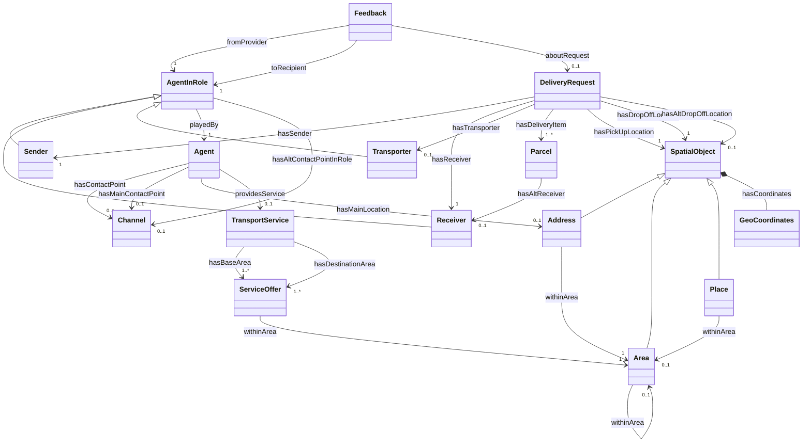

# Hulubul V1 Model

The Hulubul V1 conceptual model and everything generated from it. The **LinkML
schema is the single source of truth**; every artifact under
[`generated/`](generated/) is produced by `make` and must never be hand-edited.

## Layout

| Path | What |
|------|------|
| [`linkml/`](linkml/) | **Source of truth** — LinkML schema, six domain modules over a common base |
| [`modelspecs/`](modelspecs/) | Human source specs the model was derived from (provenance) |
| `generated/` | All generated artifacts (git-ignored — reproduce with `make`) |
| `*.qea`, `*.png` | Enterprise Architect project + exported source diagrams |

### Source schema ([`linkml/`](linkml/))

| Module | Covers |
|--------|--------|
| [`hulubul.yaml`](linkml/hulubul.yaml) | Umbrella — imports the six modules |
| [`hulubul_common.yaml`](linkml/hulubul_common.yaml) | Shared base: prefixes, reusable slots (`id`, `name`, …) |
| [`hulubul_spatial.yaml`](linkml/hulubul_spatial.yaml) | Address / Area / Place / GeoCoordinates |
| [`hulubul_channel.yaml`](linkml/hulubul_channel.yaml) | Communication channels |
| [`hulubul_agent.yaml`](linkml/hulubul_agent.yaml) | Agents and roles |
| [`hulubul_service.yaml`](linkml/hulubul_service.yaml) | Transport services / offers |
| [`hulubul_request.yaml`](linkml/hulubul_request.yaml) | Delivery requests, parcels |
| [`hulubul_feedback.yaml`](linkml/hulubul_feedback.yaml) | Feedback |

## Generated artifacts (`make <target>`)

All land under a single `generated/` tree. Run `make all` for the lot.

| Target | Output | Purpose |
|--------|--------|---------|
| `pydantic` | `generated/pydantic/hulubul_models.py` | Pydantic models |
| `owl` | `generated/owl/hulubul.owl.ttl` | OWL ontology |
| `shacl` | `generated/shacl/hulubul.shacl.ttl` | SHACL shapes (validation) |
| `jsonschema` | `generated/jsonschema/hulubul.schema.json` | JSON Schema |
| `erdiagram` | `generated/erdiagram/hulubul.er.md` | Mermaid ER diagram |
| `plantuml` | `generated/plantuml/hulubul.puml` | **UML class diagram, whole model** (PlantUML) |
| `classdiagram` | `generated/classdiagram/*.md` | UML class diagrams, one per class (Mermaid) |
| `docs` | `generated/docs/` | Markdown docs; each page embeds a Mermaid diagram |
| `neo4j-constraints` | `generated/neo4j/constraints.cypher` | Neo4j constraint DDL |
| `neomodel` | `generated/neomodel/hulubul_ogm.py` | neomodel OGM classes |

Requires `pip install linkml neomodel`. The two custom generators live in
[`../scripts/`](../scripts/).

## Class diagram (whole model)

Regenerate the authoritative UML with `make plantuml`
(`generated/plantuml/hulubul.puml`). The equivalent below renders inline on
GitHub:

