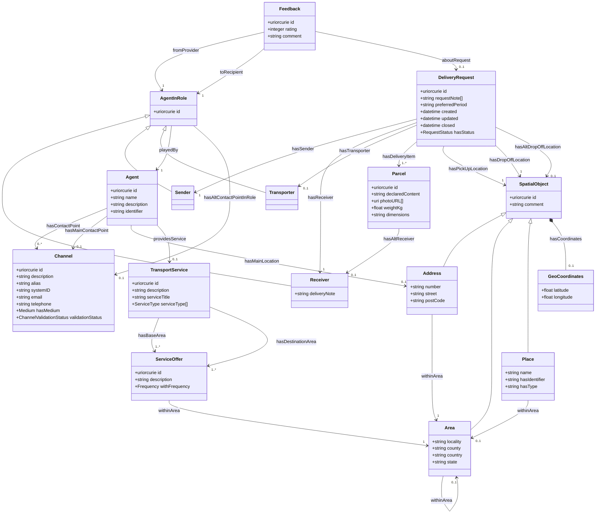

# hulubul — class diagram (whole model)

<!-- Generated by gen-mermaid-classdiagram. DO NOT EDIT — regenerate with `make classdiagram`. -->

```mermaid
classDiagram
    class Address {
        +string number
        +string street
        +string postCode
    }
    class Agent {
        +uriorcurie id
        +string name
        +string description
        +string identifier
    }
    class AgentInRole {
        +uriorcurie id
    }
    class Area {
        +string locality
        +string county
        +string country
        +string state
    }
    class Channel {
        +uriorcurie id
        +string description
        +string alias
        +string systemID
        +string email
        +string telephone
        +Medium hasMedium
        +ChannelValidationStatus validationStatus
    }
    class DeliveryRequest {
        +uriorcurie id
        +string requestNote[]
        +string preferredPeriod
        +datetime created
        +datetime updated
        +datetime closed
        +RequestStatus hasStatus
    }
    class Feedback {
        +uriorcurie id
        +integer rating
        +string comment
    }
    class GeoCoordinates {
        +float latitude
        +float longitude
    }
    class Parcel {
        +uriorcurie id
        +string declaredContent
        +uri photoURL[]
        +float weightKg
        +string dimensions
    }
    class Place {
        +string name
        +string hasIdentifier
        +string hasType
    }
    class Receiver {
        +string deliveryNote
    }
    class Sender
    class ServiceOffer {
        +uriorcurie id
        +string description
        +Frequency withFrequency
    }
    class SpatialObject {
        +uriorcurie id
        +string comment
    }
    class TransportService {
        +uriorcurie id
        +string description
        +string serviceTitle
        +ServiceType serviceType[]
    }
    class Transporter

    SpatialObject <|-- Address
    SpatialObject <|-- Area
    SpatialObject <|-- Place
    AgentInRole <|-- Receiver
    AgentInRole <|-- Sender
    AgentInRole <|-- Transporter

    Address --> "1" Area : withinArea
    Agent --> "0..*" Channel : hasContactPoint
    Agent --> "0..1" Channel : hasMainContactPoint
    Agent --> "0..1" Address : hasMainLocation
    Agent --> "0..1" TransportService : providesService
    AgentInRole --> "1" Agent : playedBy
    AgentInRole --> "0..1" Channel : hasAltContactPointInRole
    Area --> "0..1" Area : withinArea
    DeliveryRequest --> "1" Sender : hasSender
    DeliveryRequest --> "1" Receiver : hasReceiver
    DeliveryRequest --> "0..1" Transporter : hasTransporter
    DeliveryRequest --> "1..*" Parcel : hasDeliveryItem
    DeliveryRequest --> "1" SpatialObject : hasPickUpLocation
    DeliveryRequest --> "1" SpatialObject : hasDropOffLocation
    DeliveryRequest --> "0..1" SpatialObject : hasAltDropOffLocation
    Feedback --> "1" AgentInRole : fromProvider
    Feedback --> "1" AgentInRole : toRecipient
    Feedback --> "0..1" DeliveryRequest : aboutRequest
    Parcel --> "0..1" Receiver : hasAltReceiver
    Place --> "0..1" Area : withinArea
    ServiceOffer --> "1" Area : withinArea
    SpatialObject *-- "0..1" GeoCoordinates : hasCoordinates
    TransportService --> "1..*" ServiceOffer : hasBaseArea
    TransportService --> "1..*" ServiceOffer : hasDestinationArea
```

