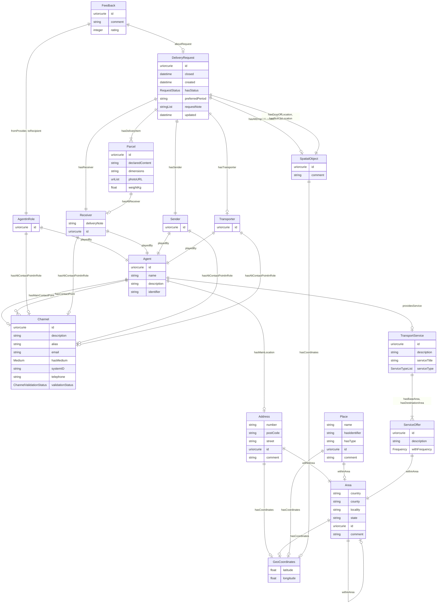

```mermaid
erDiagram
Address {
    string number  
    string postCode  
    string street  
    uriorcurie id  
    string comment  
}
Agent {
    uriorcurie id  
    string name  
    string description  
    string identifier  
}
AgentInRole {
    uriorcurie id  
}
Area {
    string country  
    string county  
    string locality  
    string state  
    uriorcurie id  
    string comment  
}
Channel {
    uriorcurie id  
    string description  
    string alias  
    string email  
    Medium hasMedium  
    string systemID  
    string telephone  
    ChannelValidationStatus validationStatus  
}
DeliveryRequest {
    uriorcurie id  
    datetime closed  
    datetime created  
    RequestStatus hasStatus  
    string preferredPeriod  
    stringList requestNote  
    datetime updated  
}
Feedback {
    uriorcurie id  
    string comment  
    integer rating  
}
GeoCoordinates {
    float latitude  
    float longitude  
}
Parcel {
    uriorcurie id  
    string declaredContent  
    string dimensions  
    uriList photoURL  
    float weightKg  
}
Place {
    string name  
    string hasIdentifier  
    string hasType  
    uriorcurie id  
    string comment  
}
Receiver {
    string deliveryNote  
    uriorcurie id  
}
Sender {
    uriorcurie id  
}
ServiceOffer {
    uriorcurie id  
    string description  
    Frequency withFrequency  
}
SpatialObject {
    uriorcurie id  
    string comment  
}
TransportService {
    uriorcurie id  
    string description  
    string serviceTitle  
    ServiceTypeList serviceType  
}
Transporter {
    uriorcurie id  
}

Address ||--|o GeoCoordinates : "hasCoordinates"
Address ||--|| Area : "withinArea"
Agent ||--|o Address : "hasMainLocation"
Agent ||--|o Channel : "hasMainContactPoint"
Agent ||--|o TransportService : "providesService"
Agent ||--}o Channel : "hasContactPoint"
AgentInRole ||--|o Channel : "hasAltContactPointInRole"
AgentInRole ||--|| Agent : "playedBy"
Area ||--|o Area : "withinArea"
Area ||--|o GeoCoordinates : "hasCoordinates"
DeliveryRequest ||--|o SpatialObject : "hasAltDropOffLocation"
DeliveryRequest ||--|o Transporter : "hasTransporter"
DeliveryRequest ||--|| Receiver : "hasReceiver"
DeliveryRequest ||--|| Sender : "hasSender"
DeliveryRequest ||--|| SpatialObject : "hasDropOffLocation, hasPickUpLocation"
DeliveryRequest ||--}| Parcel : "hasDeliveryItem"
Feedback ||--|o DeliveryRequest : "aboutRequest"
Feedback ||--|| AgentInRole : "fromProvider, toRecipient"
Parcel ||--|o Receiver : "hasAltReceiver"
Place ||--|o Area : "withinArea"
Place ||--|o GeoCoordinates : "hasCoordinates"
Receiver ||--|o Channel : "hasAltContactPointInRole"
Receiver ||--|| Agent : "playedBy"
Sender ||--|o Channel : "hasAltContactPointInRole"
Sender ||--|| Agent : "playedBy"
ServiceOffer ||--|| Area : "withinArea"
SpatialObject ||--|o GeoCoordinates : "hasCoordinates"
TransportService ||--}| ServiceOffer : "hasBaseArea, hasDestinationArea"
Transporter ||--|o Channel : "hasAltContactPointInRole"
Transporter ||--|| Agent : "playedBy"

```

